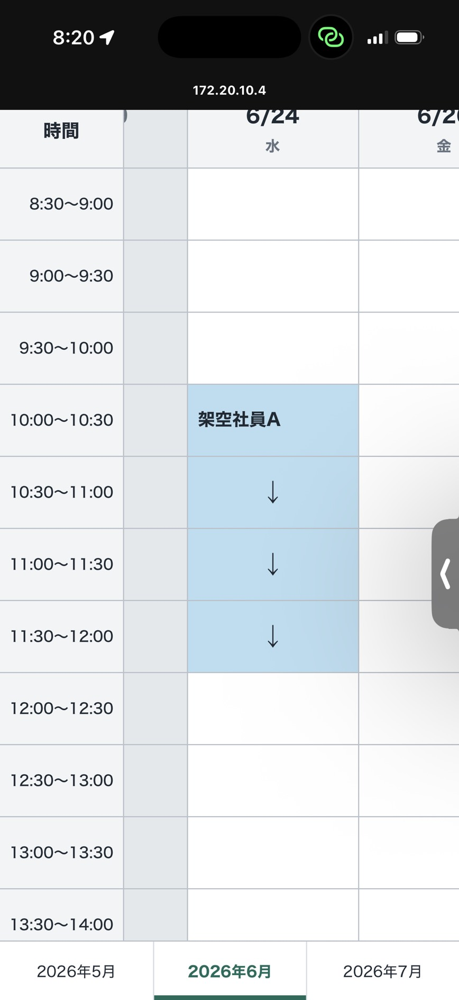
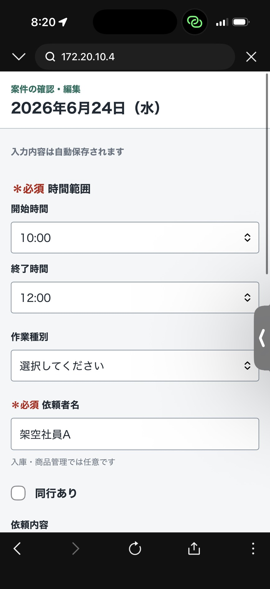

# 配送・設置案件スケジュール管理システム

配送・設置案件をExcelで日付別に管理している現場を想定し、案件情報、依頼者、時間帯、依頼内容、集合情報、車両情報などをWeb上で一元管理するためのポートフォリオ開発プロジェクトです。

**開発状況:** 初期MVP、フェーズ5Aから5Gまでの初回導入機能、UI改善、統合整理が完了し、フェーズ6Aでクラウド試験用の共通パスワードゲートとPostgreSQL接続設定を追加し、フェーズ6Bでクラウド向けのスケジュールデータ保持期間制御を追加しました。フェーズ6CではRender Free Web ServiceとNeon Free PostgreSQLを使ったクラウド試験環境を作成し、共有URLで起動できる状態まで進めています。現在は6C残作業、6D、6Eを優先します。Java 21、H2、PostgreSQL Testcontainers、Playwright Chromiumを含む全122件の自動テストが成功しています。

現行業務では、共有Excel上で「誰が、いつ、どの案件を入れたか」は確認できますが、住所、依頼内容、同行有無、集合場所、車両、作業メモなどの詳細がセル内に収まりにくく、担当者への個別確認が発生しやすい状態です。本システムでは、スケジュール表から案件詳細へ自然に遷移できる構成にし、現場担当者と社員双方の確認コストを減らすことを目的とします。

## 開発目的

- Excel運用で発生している情報不足、確認漏れ、属人化を改善する
- 案件ごとの詳細情報を構造化し、後から確認しやすくする
- Java / Spring Boot / DBを中心に、SIer就活で説明しやすいWebアプリとして段階的に開発する
- 上流工程、設計、実装、テスト、改善の流れをポートフォリオとして示す

## 想定ユーザー

- 社員: 案件を入力し、作業内容を共有する
- 配送・設置担当者: 入力された案件の詳細情報を確認する
- 利用者全員: ログインや権限差は設けず、同じ権限で参照・編集できる
- 約10人の利用者が、現行の共有Excelと同様に1つのスケジュールを共同利用する
- 各利用者はインストールせず、共有されたURLをPCまたはiPhoneのブラウザで開いて利用する

## 初期MVPで目指す範囲

- 対象月の水曜日・金曜日を日付列とする、Excelに近い30分単位のスケジュール表
- 合意した最小限の項目を持つ案件入力フォーム
- サイトを開いた時点の日本時間から現在月を取得して自動表示し、前月・当月・翌月の月タブで切り替える操作
- 日本時間の今日より前は閲覧専用、今日以降は編集可能とする制御
- 入力内容の自動保存と、月間スケジュール一覧への反映
- 一覧上部の下書き一覧から、未完成入力と時間重複で未反映の入力を理由付きで再開・削除。作業日を過ぎた下書きは日本時間を基準に自動削除
- 同じ日の既存案件との時間範囲重複チェック
- 開始時間・終了時間は8:30-17:30の30分単位から選択
- 二重確認付きの依頼キャンセルと案件の物理削除
- 同時登録時の先着優先と、後続利用者への具体的なエラー表示
- iPhoneでスケジュール一覧と案件詳細を正常に閲覧できること

左上の年月選択、祝日カレンダー連携、休み設定、案件コピー、全面UIリニューアルは初期MVPの完成条件に含めず、フェーズ5で段階的に追加します。追加機能を先に完成させた後、現在の機能を変えずに全画面を洗練されたモノトーン基調へ刷新し、最後に統合試験を行います。次の機能は、初期MVP後も含めたシステム全体の開発範囲です。

- 空白セルから新規入力フォームへ移動し、入力済みセルから既存案件の確認・編集フォームへ移動する操作
- 案件の入力、編集、詳細確認
- 依頼者名、時間範囲、6種類の作業種別、依頼内容、住所、顧客先到着希望時間の管理
- 同行ありの場合の集合場所、出発時間、任意の使用車両指定の管理

個人別ログインと権限管理は将来も導入せず、全員が同じ権限で使う方針とします。クラウド配置時だけ、URL漏洩時の最低限の入口制限として共通パスワードゲートを利用します。任意年月選択、祝日カレンダー連携、休み設定、案件コピー、全面UIリニューアルはフェーズ5Bから5Fで実装済みです。案件ステータス管理、地図連携、ルート最適化、業務予定の外部カレンダー連携などは将来拡張として扱います。通知は試運転で見落としが発生した場合だけ追加を検討します。生成AIによる使い方Q&Aと案件入力支援は、MVP完成後に実行環境と情報管理方針を確認して試作します。現行Excelの予定は取り込まず、新システムは空の状態から利用を開始します。

利用者は共有URLをブラウザで開いて利用する。PWAなどの正式なインストール機能は作らず、必要な場合はブラウザのブックマークやホーム画面ショートカットを利用する。

開発は、最小の縦切り機能、改訂版MVP、初回導入機能、全面UIリニューアル、統合試験、正式運用準備、社員最終受入の順に進めます。実在案件を入力する前に、会社の情報管理方針、正式な配置先、DBバックアップ、架空データを使った復元手順を確認します。

## 技術方針

フェーズ1では、次の構成を採用します。

- Java 21 LTS
- Spring Boot 3.5.15
- Thymeleafと必要最小限のJavaScript
- Spring Data JPA / Hibernate
- Flyway
- H2（単独でのローカル開発・デモ）
- PostgreSQL（複数人共有、本番想定・競合テスト）
- JUnit 5 / Testcontainers
- Playwright for Java（主要ブラウザE2E）
- Maven Wrapper

詳しい選定理由と同時実行方式は、[技術選定・検証記録](docs/technical-decisions.md)に記載しています。

## 画面

<p>
  
  
</p>

月間一覧では、案件の先頭セルに依頼者名と作業種別、後続セルに矢印を表示する。PCでの入力を主対象とし、iPhoneでは同じ画面を縦横スクロール、拡大して閲覧できる。

## Dockerで起動する

必要なもの:

- Docker Desktop

次のコマンドで、Spring BootアプリをDockerコンテナ上でビルドして起動する。

```powershell
docker compose up --build
```

起動後、ホストPCのブラウザで `http://localhost:8080` を開く。

Docker起動では、通常起動と同じH2ファイルDBを使用し、保存データはホスト側の `data/` に保持される。コンテナを停止・再起動しても同じ `data/` から案件を読み込む。`data/` はGitの管理対象外である。

Dockerデモでは、外部CSVを使う祝日カレンダー同期を無効化している。祝日同期を含む挙動は、ローカル開発または正式な共有環境で確認する。

停止する場合:

```powershell
docker compose down
```

データを初期化したい場合は、アプリ停止後に `data/` を削除する。ただし、保存済み案件も消えるため、必要なデータがないことを確認してから行う。

このDocker構成は、単独利用のローカル確認とデモを目的とする。複数人で共有試験を行う場合は、README下部の技術方針どおりPostgreSQL構成を別途用意する。

## ローカル開発

必要なもの:

- Java 21
- Docker Desktop（Docker起動、またはPostgreSQL結合テストを実行する場合）
- Playwright Chromium（主要ブラウザE2Eを実行する場合）

Windowsでアプリを起動する:

```powershell
.\mvnw.cmd spring-boot:run
```

ブラウザで `http://localhost:8080` を開く。日本時間の現在月にある水曜日・金曜日が月間一覧に表示され、空白セルから案件を入力できる。

通常起動ではH2ファイルDBを使用し、保存データは `data/schedule-system.mv.db` に保持される。アプリを停止・再起動しても同じファイルから案件を読み込む。`data/` はGitの管理対象外である。

H2は単独でのローカル開発とデモに限定する。H2にはPostgreSQL固有の時間範囲排他制約がないため、H2で起動したURLを複数人へ共有して試験運用しない。複数人が同時に利用する共有試験と正式運用ではPostgreSQLを必須とする。

## クラウド試験用設定

無料クラウド試験では `cloud` profileを使い、PostgreSQLと共通パスワードゲートを有効にする。これは利用者を識別するためのログイン機能ではなく、URLを知っている人だけが開ける状態に近づけるための入口制限である。利用者は共有URLを開いた後、画面上で共通パスワードだけを入力する。

現在の試験環境では、Render Free Web ServiceとNeon Free PostgreSQLを使用する。Renderの無料枠では一定時間アクセスがないとインスタンスがスリープし、初回アクセスやスリープ復帰時に起動待ちが発生する可能性がある。正式運用前には、社員が実際に使う時間帯で起動遅延、保存、再表示、端末表示を確認する。

必要な環境変数:

| 環境変数 | 用途 |
| --- | --- |
| `SPRING_PROFILES_ACTIVE` | `cloud` を指定する |
| `SPRING_DATASOURCE_URL` | PostgreSQLのJDBC URL |
| `SPRING_DATASOURCE_USERNAME` | PostgreSQLのユーザー名 |
| `SPRING_DATASOURCE_PASSWORD` | PostgreSQLのパスワード |
| `SCHEDULE_ACCESS_PASSWORD` | 共通パスワードゲートのパスワード |
| `SPRING_DATASOURCE_HIKARI_MAXIMUM_POOL_SIZE` | 任意。無料DB向けの最大接続数。未指定時は3 |
| `SCHEDULE_HOLIDAYS_SYNC_ENABLED` | 任意。祝日同期を有効にするか。未指定時はtrue |
| `SCHEDULE_RETENTION_ENABLED` | 任意。作業日から1か月を過ぎたスケジュールデータの起動時削除を有効にするか。cloud profileでは未指定時true |

秘密値はGit管理ファイルへ書かず、Renderなどのクラウドサービス側の環境変数に設定する。クラウドprofileでは、ローカルH2ではなくPostgreSQLへ接続し、FlywayのPostgreSQL用Migrationも読み込む。

cloud profileでは、起動時に日本時間の現在日を基準として、`作業日 < 今日の1か月前` の公開済み案件、下書き、休み設定を物理削除する。例えば2026年7月1日に起動した場合、2026年5月31日以前を削除し、2026年6月1日以降は保持する。祝日キャッシュは削除対象外で、ログには削除件数だけを出力する。なお、下書き一覧取得時に作業日を過ぎた下書きを削除する既存仕様は、この保持期間制御とは別に維持する。

## 使い方

現在利用できる操作:

- 前月・当月・翌月の月間一覧を切り替える
- 空白セルから対象日を引き継いで案件を登録する
- 入力済みセルから案件を開いて編集する
- 時間が重なる入力をエラーとして保持し、入力値を画面に残す
- 入力欄を離れた時点で自動保存する
- 入力不足または時間重複の下書きを一覧から再開・削除する
- 公開済み案件を編集し、二重確認後にキャンセルする
- 過去案件を閲覧専用で開く
- 存在しない案件やURLから一覧へ戻る

フォームの「一覧へ戻る」は、保存待ちの入力がある場合は完了を待ってから対象月の一覧へ戻る。

## デモデータ

架空データ6件でデモする場合は、通常データと分離した専用H2ファイルを使う。

```powershell
.\mvnw.cmd '-Dspring-boot.run.profiles=demo' spring-boot:run
```

デモでは、現在日以降の水曜日・金曜日に、設置、回収、交換、配達、入庫、商品管理を1件ずつ投入する。既存のデモDBにデータがある場合は追加投入しない。

初回だけPlaywright Chromiumをインストールする:

```powershell
.\mvnw.cmd '-Dexec.mainClass=com.microsoft.playwright.CLI' '-Dexec.classpathScope=test' '-Dexec.args=install chromium' exec:java
```

全テストを実行する:

```powershell
.\mvnw.cmd test
```

アプリ再起動とH2ファイル保持だけを確認する:

```powershell
.\mvnw.cmd '-Dtest=ApplicationRestartPersistenceTest' test
```

この試験は一時H2ファイルへ架空案件を保存し、Spring Bootを停止・再起動して一覧、詳細、Flyway履歴を確認する。通常利用の `data/` は変更しない。

全テストではPlaywrightがChromiumを起動し、TestcontainersがPostgreSQLを一時起動するため、Docker Desktopも先に起動する。

## ドキュメント

ヒアリング中の最新判断は、まず要件ヒアリング議事録を優先して確認します。正式な要件定義書には、ヒアリングが一巡した後に反映します。

- [要件定義](docs/requirements.md)
- [要件ヒアリング議事録](docs/requirements-interview.md)
- [業務フロー](docs/business-flow.md)
- [画面一覧](docs/screen-list.md)
- [データベース設計](docs/database-design.md)
- [技術選定・検証記録](docs/technical-decisions.md)
- [システム構成](docs/architecture.md)
- [開発ロードマップ](docs/development-roadmap.md)
- [テスト方針](docs/test-policy.md)
- [フェーズ4 テスト設計](docs/phase4-test-design.md)
- [フェーズ4 性能・容量試験結果](docs/phase4-performance-results.md)
- [フェーズ4 手動端末試験結果](docs/phase4-manual-device-results.md)
- [フェーズ5F UIリニューアル抜き出し計画](docs/phase5f-ui-refresh-plan.md)
- [Codex 開発チーム運用ルール](docs/codex-agent-team.md)

## 開発ルール

- mainブランチへ直接変更しない
- 作業ごとにブランチを作成し、Pull Requestで変更する
- Codexは原則としてブランチ作成、実装、差分確認、ローカル状態確認までを担当し、commit、push、PR作成、マージはユーザーが行う
- Codexがcommit、push、PR作成を代理実行するのは、ユーザーが明示的に依頼した場合だけとする
- 作業開始前に `AGENTS.md`、`README.md`、`docs/development-roadmap.md` を確認する
- 必要な場合だけ、Codexサブエージェントをレビュー補助として使う。サブエージェントには実装、commit、push、PR作成、マージを任せない
- ドキュメント単独の変更は専用PRに分け、機能実装と対応する単体・結合テストは原則として同じPRに含める
- 未テストの機能実装だけをmainへ取り込まない
- 実在する会社名、人名、住所、電話番号、車両番号、顧客名などは使わない
- サンプルデータは必ず架空データにする
- MVPと将来拡張を分けて管理する
- 個人別ログインや権限差は将来も設けず、掲示板のように全員が同じ権限で参照・編集する
- ローカル開発では追加のアクセス制限を設けない。クラウド配置では共通パスワードゲートを環境変数で有効化する
