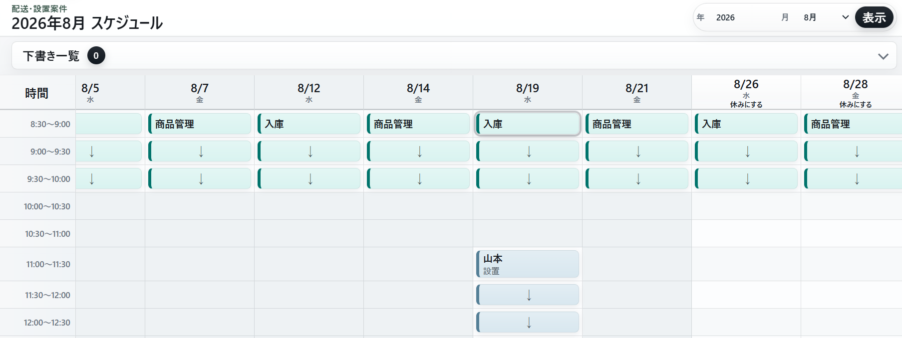
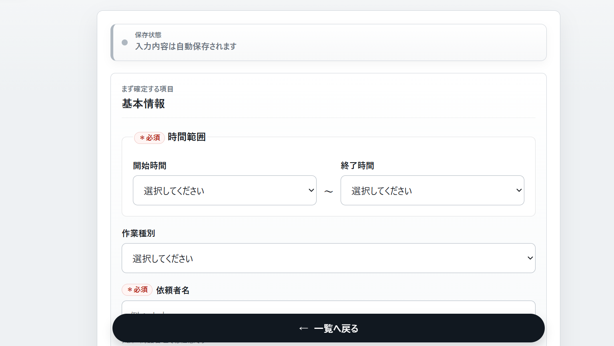
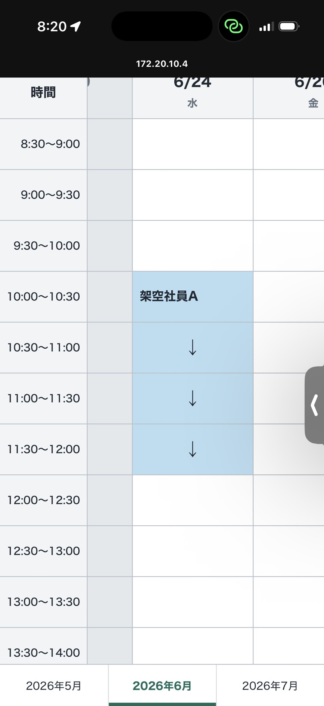
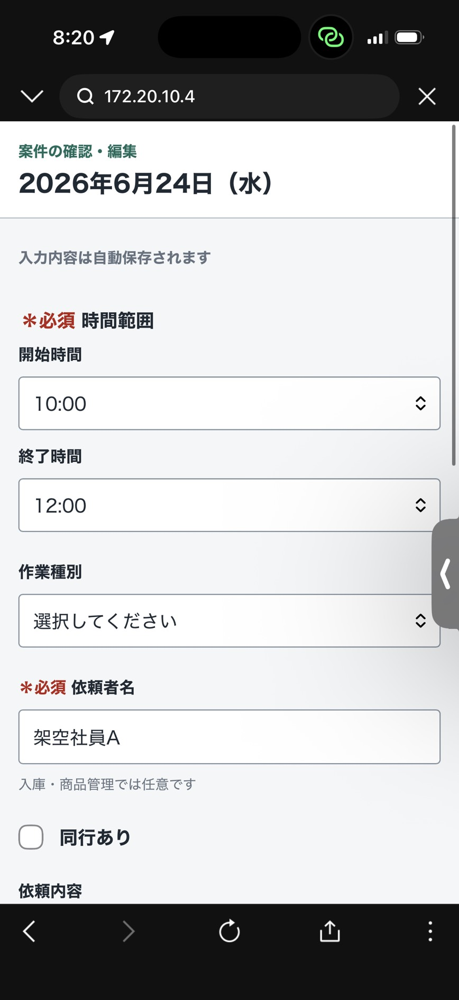
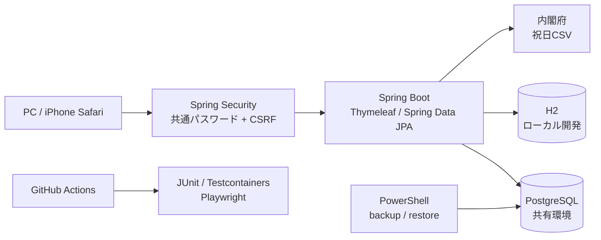

# 配送・設置案件スケジュール管理システム

[](https://github.com/yuya-dev-dev/schedule-system/actions/workflows/ci.yml)

共有Excelで管理していた配送・設置案件を、複数人で安全に共有・更新するためのJava / Spring Boot業務Webアプリケーションです。

## 概要

配送・設置担当者である開発者本人が、社員から依頼された案件を月間スケジュールから確認するために開発したシステムです。社員が案件を登録し、時間帯だけでなく、依頼内容、住所、同行有無、集合場所、車両、作業メモなどを構造化して共有します。

Excelに近い30分単位の一覧性を残しつつ、各セルから詳細画面へ移動できる構成にしました。PCとiPhone Safariのどちらからでも、案件の確認、登録、編集を行えます。

| 項目 | 内容 |
| --- | --- |
| 開発形態 | 個人開発 |
| 開発期間 | 2026年6月〜現在 |
| 担当範囲 | 業務課題の整理、要件定義、設計、実装、テスト、Render・Neonでの運用 |
| 利用状況 | 社員5人程度による受入テストを経て、10人弱で正式運用中 |

### 画面

#### PC画面

| 月間スケジュール | 案件入力フォーム |
| --- | --- |
|  |  |

#### スマートフォン画面（iPhone Safari）

| 月間スケジュール | 案件詳細 |
| --- | --- |
|  |  |

月間一覧では、案件の先頭セルに依頼者名と作業種別、後続セルに矢印を表示する。スマートフォンでも同じ画面を縦横スクロール、拡大しながら、案件の確認と入力を行える。

## 解決した業務課題

- Excelのセルに案件詳細が収まらず、住所や集合情報を担当者へ個別確認する必要がある
- 共有Excelはスマートフォンでの閲覧や入力に不向きで、利用する端末によって案件登録のしやすさに差がある
- 情報の記載場所や粒度がそろわず、確認漏れや属人化が起きやすい
- 複数人が同じ時間帯を更新した場合に、予定重複や後勝ち上書きを防ぐ必要がある
- 未完成入力や競合入力を失わず、後から理由付きで再開できる仕組みが必要である

## 現在の状況・導入成果

初期MVPと初回導入機能、UI改善、クラウド対応まで完了しています。H2、PostgreSQL Testcontainers、Playwright Chromiumを含む自動テストをGitHub Actionsで実行しています。

- 受入テストでは社員5人程度が架空データで主要操作を確認し、正式導入を妨げる重大な問題は検出されなかった
- 受入テスト後、10人弱を対象とする正式運用を開始し、実在案件を入力している

### 導入前後の変化

| 観点 | 導入前 | 導入後 |
| --- | --- | --- |
| 案件詳細の確認 | Excelに収まらない情報を毎朝、口頭やメールで個別確認 | 依頼内容、住所、集合場所などを画面で確認 |
| スマートフォン利用 | 共有Excelでは閲覧・入力しづらい | PCとiPhone Safariのどちらからでも登録・確認 |
| 情報の整理 | 記載場所や粒度がそろわず、伝達漏れが発生 | 入力項目を構造化し、確認の手間と伝達漏れによるトラブルが減少 |

Render Free Web ServiceとNeon Free PostgreSQL上で実在案件の入力を開始しています。日次PostgreSQLバックアップ、SHA-256検証、隔離復元、障害時手順は架空データで検証済みであり、正式運用中の実施記録は[運用ランブック](docs/operations-runbook.md)に従って管理します。

## 設計・実装における技術的工夫

- **同じ時間への二重登録を防ぐ:** 保存前の重複検査、日付単位のPostgreSQLトランザクションロック、DBのGiST exclusion constraintを組み合わせる
- **競合しても入力内容を失わない:** DB競合をSQLSTATE `23P01`と`40P01`で識別し、後続入力を理由付きの`DRAFT`として別トランザクションで保存する
- **古い画面からの上書きを防ぐ:** JPAの`@Version`による楽観ロックで、ほかの利用者が更新した後の古い編集を拒否する
- **実際のDBとブラウザで品質を確認する:** H2の単体・結合テストに加え、Testcontainers PostgreSQLの競合テストとPlaywright ChromiumのE2EをGitHub Actionsで実行する
- **障害時に復旧できるようにする:** Flyway Migration、custom formatの日次バックアップ、SHA-256検証、ネットワークを切った隔離復元を用意し、Dockerビルドから復元成功までをCIで検証する
- **業務用URLへの入口を保護する:** 共通パスワードゲート、CSRF防御、試行制限、セッション失効、ログアウトを有効にし、秘密値は環境変数で管理する

### システム構成


```mermaid
flowchart LR
    Browser[PC / iPhone Safari] --> Security[Spring Security<br>共通パスワード + CSRF]
    Security --> App[Spring Boot<br>Thymeleaf / Spring Data JPA]
    App --> PostgreSQL[(PostgreSQL<br>共有環境)]
    App --> H2[(H2<br>ローカル開発)]
    App --> Holidays[内閣府<br>祝日CSV]
    Backup[PowerShell<br>backup / restore] --> PostgreSQL
    CI[GitHub Actions] --> Tests[JUnit / Testcontainers<br>Playwright]
```

## 技術スタック

| 区分 | 技術 |
| --- | --- |
| Application | Java 21, Spring Boot 3.5.15, Thymeleaf, Spring Data JPA / Hibernate |
| Database | PostgreSQL, H2, Flyway |
| Test | JUnit 5, Testcontainers, Playwright for Java |
| Delivery / Operations | Maven Wrapper, Docker, GitHub Actions, Render, Neon |

詳しい選定理由と同時実行方式は、[技術選定・検証記録](docs/technical-decisions.md)に記載しています。

## 運用環境

正式運用では、Render Free Web Serviceでアプリを実行し、Neon Free PostgreSQLへ案件を保存しています。10人弱の利用者へ業務用URLをメールで共有し、共通パスワードを入力して利用する方式です。

業務用URLは実在案件を扱うため、ポートフォリオ閲覧者向けの公開デモには使用しません。READMEの起動手順では、本番DBや秘密情報へ接続せず、架空データで安全に確認できるDockerまたはローカルH2の手順を案内しています。

## 起動方法

以下は、第三者がローカル環境で動作を確認するための手順です。

### Dockerでローカル確認する

必要なもの:

- Docker Desktop

次のコマンドで、Spring BootアプリをDockerコンテナ上でビルドして起動する。

```powershell
docker compose up --build
```

起動後、ホストPCのブラウザで `http://localhost:8080` を開く。

Docker起動では、通常起動と同じH2ファイルDBを使用し、保存データはDockerのnamed volume `schedule-data` に保持される。コンテナを停止・再起動しても同じvolumeから案件を読み込む。

Dockerデモでは、外部CSVを使う祝日カレンダー同期を無効化している。祝日同期を含む挙動は、ローカル開発または正式な共有環境で確認する。

停止する場合:

```powershell
docker compose down
```

データを初期化したい場合は、保存済み案件が不要であることを確認してから `docker compose down --volumes` を実行する。

このDocker構成は、単独利用のローカル確認とデモを目的とする。複数人で共有確認を行う場合は、READMEの「正式運用のクラウド設定（運用担当者向け）」と同等のPostgreSQL構成を別途用意する。

### Maven Wrapperで開発起動する

必要なもの:

- Java 21
- Docker Desktop（Docker起動、またはPostgreSQL結合テストを実行する場合）
- Playwright Chromium（主要ブラウザE2Eを実行する場合）

Windowsでアプリを起動する:

```powershell
.\mvnw.cmd spring-boot:run
```

ブラウザで `http://localhost:8080` を開く。日本時間の現在月にある水曜日・金曜日が月間一覧に表示され、空白セルから案件を入力できる。

通常起動ではH2ファイルDBを使用し、保存データは `data/schedule-system.mv.db` に保持される。アプリを停止・再起動しても同じファイルから案件を読み込む。`data/` はGitの管理対象外である。

H2は単独でのローカル開発とデモに限定する。H2にはPostgreSQL固有の時間範囲排他制約がないため、H2で起動したURLを複数人へ共有して試験運用しない。複数人が同時に利用する共有試験と正式運用ではPostgreSQLを必須とする。

### 正式運用のクラウド設定（運用担当者向け）

<details>
<summary>設定詳細を表示</summary>

正式運用では `cloud` profileを使い、PostgreSQLと共通パスワードゲートを有効にする。これは利用者を識別するためのログイン機能ではなく、URLを知っている人だけが開ける状態に近づけるための入口制限である。利用者は共有URLを開いた後、画面上で共通パスワードだけを入力する。cloud profileでアクセスゲートを無効化した場合は起動を中止し、すべての状態変更POSTはCSRFトークンで保護する。同一送信元から15分以内に5回失敗すると15分間ログインを拒否し、ログイン後のセッションは30分の無操作で失効する。月間画面から明示的にログアウトできる。

現在の運用環境では、Render Free Web ServiceとNeon Free PostgreSQLを使用する。当面は無料枠を継続し、初回アクセスやスリープ復帰時のロード時間について利用者から改善要望が出た場合に限り、有料構成への切り替えを検討する。

必要な環境変数:

| 環境変数 | 用途 |
| --- | --- |
| `SPRING_PROFILES_ACTIVE` | `cloud` を指定する |
| `SPRING_DATASOURCE_URL` | PostgreSQLのJDBC URL |
| `SPRING_DATASOURCE_USERNAME` | PostgreSQLのユーザー名 |
| `SPRING_DATASOURCE_PASSWORD` | PostgreSQLのパスワード |
| `SCHEDULE_ACCESS_PASSWORD` | 共通パスワードゲートのパスワード |
| `SPRING_DATASOURCE_HIKARI_MAXIMUM_POOL_SIZE` | 任意。無料DB向けの最大接続数。未指定時は3 |
| `SCHEDULE_HOLIDAYS_SYNC_ENABLED` | 任意。祝日同期を有効にするか。未指定時はtrue |
| `SCHEDULE_RETENTION_ENABLED` | 任意。作業日から1か月を過ぎたスケジュールデータの起動時削除を有効にするか。cloud profileでは未指定時true |

秘密値はGit管理ファイルへ書かず、Renderなどのクラウドサービス側の環境変数に設定する。共通パスワードは管理担当者だけが変更し、秘密値そのものはドキュメント、Git、会話へ記録しない。クラウドprofileでは、ローカルH2ではなくPostgreSQLへ接続し、FlywayのPostgreSQL用Migrationも読み込む。

cloud profileでは、起動時に日本時間の現在日を基準として、`作業日 < 今日の1か月前` の公開済み案件、下書き、休み設定を物理削除する。例えば2026年7月1日に起動した場合、2026年5月31日以前を削除し、2026年6月1日以降は保持する。祝日キャッシュは削除対象外で、ログには削除件数だけを出力する。

起動時と、アプリ稼働中の毎日3時（日本時間）には、祝日データを確認してから今月・翌月の固定予定を不足分だけ作成し、作業日を過ぎた下書きを削除する。無料枠の停止中に3時を過ぎた場合は、次回起動時に実行する。祝日同期に失敗して利用可能なキャッシュもない場合は、祝日へ誤登録しないよう固定予定作成だけを見送る。月間一覧のGETはDBを更新しない。

</details>

### デモデータ

架空データ6件でデモする場合は、通常データと分離した専用H2ファイルを使う。

```powershell
.\mvnw.cmd '-Dspring-boot.run.profiles=demo' spring-boot:run
```

デモでは、現在日以降の水曜日・金曜日に、設置、回収、交換、配達、入庫、商品管理を1件ずつ投入する。既存のデモDBにデータがある場合は追加投入しない。

### テスト

初回だけPlaywright Chromiumをインストールする:

```powershell
.\mvnw.cmd '-Dexec.mainClass=com.microsoft.playwright.CLI' '-Dexec.classpathScope=test' '-Dexec.args=install chromium' exec:java
```

全テストを実行する:

```powershell
.\mvnw.cmd test
```

アプリ再起動とH2ファイル保持だけを確認する:

```powershell
.\mvnw.cmd '-Dtest=ApplicationRestartPersistenceTest' test
```

この試験は一時H2ファイルへ架空案件を保存し、Spring Bootを停止・再起動して一覧、詳細、Flyway履歴を確認する。通常利用の `data/` は変更しない。

全テストではPlaywrightがChromiumを起動し、TestcontainersがPostgreSQLを一時起動するため、Docker Desktopも先に起動する。

## 詳細資料

- [要件定義](docs/requirements.md)
- [システム構成](docs/architecture.md)
- [技術選定・検証記録](docs/technical-decisions.md)
- [テスト方針](docs/test-policy.md)
- [正式運用ランブック](docs/operations-runbook.md)

<details>
<summary>主な操作</summary>

- 前月・当月・翌月の月間一覧を切り替える
- 年月を直接指定して任意の過去月・未来月へ移動する
- 空白セルから対象日を引き継いで案件を登録する
- 入力済みセルから案件を開いて編集する
- 時間が重なる入力をエラーとして保持し、入力値を画面に残す
- 入力欄を離れた時点で自動保存する
- 入力不足または時間重複の下書きを一覧から再開・削除する
- 公開済み案件を編集し、二重確認後にキャンセルする
- 公開済み案件を別の勤務日へコピーする
- 日付単位で休みを設定・解除する
- 祝日を除外し、水曜日8:30-10:00の入庫と金曜日8:30-10:00の商品管理を今月・翌月へ自動作成する
- 過去案件を閲覧専用で開く
- 存在しない案件やURLから一覧へ戻る

フォームの「一覧へ戻る」は、保存待ちの入力がある場合は完了を待ってから対象月の一覧へ戻る。

固定予定は入庫・商品管理専用色で通常案件と区別する。同じ時間帯に既存予定がある日、祝日、休み、過去日には自動作成しない。固定予定を個別削除した日は再作成せず、休み設定で削除された固定予定は休み解除時に今月・翌月の範囲だけ再作成する。

</details>

<details>
<summary>開発履歴と全ドキュメント</summary>

### 全ドキュメント

主要な設計資料はREADME上部に掲載しています。開発履歴を含む全資料は次のとおりです。

- [要件定義](docs/requirements.md)
- [要件ヒアリング議事録](docs/requirements-interview.md)
- [業務フロー](docs/business-flow.md)
- [画面一覧](docs/screen-list.md)
- [データベース設計](docs/database-design.md)
- [技術選定・検証記録](docs/technical-decisions.md)
- [システム構成](docs/architecture.md)
- [開発ロードマップ](docs/development-roadmap.md)
- [テスト方針](docs/test-policy.md)
- [正式運用ランブック](docs/operations-runbook.md)
- [フェーズ4 テスト設計](docs/phase4-test-design.md)
- [フェーズ4 性能・容量試験結果](docs/phase4-performance-results.md)
- [フェーズ4 手動端末試験結果](docs/phase4-manual-device-results.md)
- [フェーズ5F UIリニューアル抜き出し計画](docs/phase5f-ui-refresh-plan.md)
- [Java可読性リファクタリング計画](docs/java-readability-refactoring-plan.md)
- [Javaコード読解ガイド](docs/java-code-reading-guide.md)

### 開発の背景と経緯

#### 開発目的

- Excel運用で発生している情報不足、確認漏れ、属人化を改善する
- 案件ごとの詳細情報を構造化し、後から確認しやすくする
- Java / Spring Boot / DBを中心に、業務要件と整合性を重視したWebアプリとして段階的に開発する
- 要件定義、設計、実装、テスト、改善の判断を追跡できる形で記録する

#### 想定ユーザー

- 社員: 案件を入力し、作業内容を共有する
- 配送・設置担当者: 入力された案件の詳細情報を確認する
- 利用者全員: 個人別ログインや権限差を設けず、同じ権限で参照・編集する
- 正式運用では10人弱の利用者が、現行の共有Excelと同様に1つのスケジュールを共同利用する
- 各利用者はインストールせず、共有されたURLをPCまたはiPhoneのブラウザで開いて利用する

#### 初期MVPと追加開発

開発当初は、次を初期MVPの範囲として定義しました。

- 対象月の水曜日・金曜日を日付列とする、Excelに近い30分単位のスケジュール表
- 合意した最小限の項目を持つ案件入力フォーム
- 日本時間の現在月を自動表示し、前月・当月・翌月の月タブで切り替える操作
- 過去日は閲覧専用、今日以降は編集可能とする制御
- 入力内容の自動保存と、月間スケジュール一覧への反映
- 未完成入力と時間重複で未反映の入力を、理由付きで再開・削除できる下書き一覧
- 同じ日の既存案件との時間範囲重複チェック
- 8:30-17:30の30分単位による時間入力
- 二重確認付きの依頼キャンセルと案件の物理削除
- 同時登録時の先着優先と、後続利用者への具体的なエラー表示
- iPhoneでのスケジュール一覧と案件詳細の閲覧

初期MVP後に、任意年月選択、祝日カレンダー連携、休み設定、案件コピー、固定予定、全面UIリニューアル、クラウド対応を段階的に追加しました。画面からは案件の入力、編集、詳細確認に加え、6種類の作業種別、依頼内容、住所、顧客先到着希望時間、同行時の集合場所、出発時間、車両を管理できます。

個人別ログインと権限管理は導入せず、クラウド環境だけ共通パスワードゲートを使用します。案件ステータス管理、地図連携、ルート最適化、業務予定の外部カレンダー連携は将来拡張として扱います。現行Excelの予定は取り込まず、新システムは空の状態から利用を開始する方針です。

利用者は共有URLをブラウザで開いて利用します。PWAなどの正式なインストール機能は設けず、必要な場合はブラウザのブックマークやホーム画面ショートカットを利用します。

### 開発ルール

- コード、DB、認証、クラウド設定、デプロイ挙動へ影響する変更は作業ブランチとPull Requestを使い、mainへ直接反映しない
- ドキュメントだけの変更は、ユーザーの明示判断がある場合に限りmainへ直接commit・pushしてよい
- 作業開始前に `AGENTS.md`、`README.md`、`docs/development-roadmap.md` を確認する
- ドキュメント単独の変更をPRにする場合は機能変更と混在させず、機能実装と対応する単体・結合テストは原則として同じPRに含める
- 未テストの機能実装だけをmainへ取り込まない
- 実在する会社名、人名、住所、電話番号、車両番号、顧客名などは使わない
- サンプルデータは必ず架空データにする
- MVPと将来拡張を分けて管理する
- 個人別ログインや権限差は将来も設けず、掲示板のように全員が同じ権限で参照・編集する
- ローカル開発では追加のアクセス制限を設けない。クラウド配置では共通パスワードゲートを環境変数で有効化する

</details>
