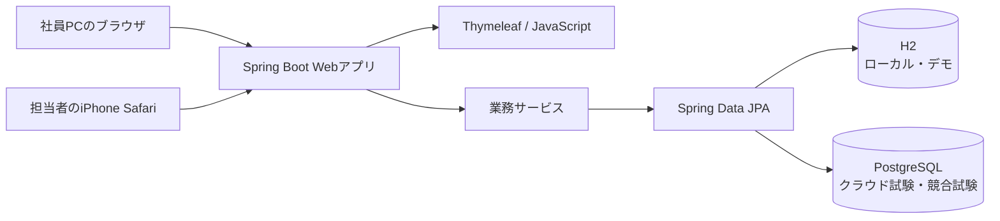
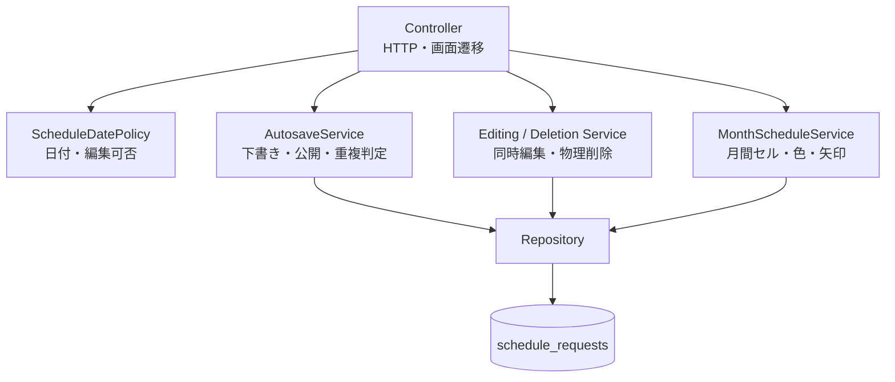

# システム構成

## 全体構成

利用者はインストールせず、同じURLをブラウザで開く。個人別ログインや権限差は設けず、約10人が1つのスケジュールを共同利用する。クラウド配置時だけ、URL漏洩時の最低限の入口制限として共通パスワードゲートを使う。

## アプリケーション内の責務

## 保存と競合制御

1. 入力欄を離れた時点でJavaScriptが自動保存APIを呼ぶ
2. 依頼者名と時間範囲がそろわない入力は下書きとして保持する
3. 一覧反映条件を満たす入力は、同日の既存案件と時間範囲を照合する
4. 重複がなければ公開し、重複時は理由付き下書きとして入力値を保持する
5. PostgreSQLでは排他制約を最終防衛線とし、同時登録でも先着案件だけを公開する
6. 編集は楽観ロック、キャンセルは確認時のバージョン照合により他者の更新を保護する

## 環境の使い分け

| 環境 | DB | 用途 |
| --- | --- | --- |
| 通常ローカル | H2ファイル | 日常開発、再起動後のデータ保持 |
| デモ | 専用H2ファイル | 架空案件6件を使ったポートフォリオ説明 |
| 自動テスト | H2メモリ | 単体、結合、ブラウザE2E、性能・容量確認 |
| DB競合試験 | PostgreSQL Testcontainers | 排他制約、同時登録、トランザクション確認 |
| クラウド試験 | Render Free Web Service + Neon Free PostgreSQL | URL共有、共通パスワードゲート、PostgreSQL保存、無料枠制約の確認 |
| 正式運用候補 | PostgreSQL | 実在案件の入力前に、バックアップ、復元方法、無料枠継続可否を決定 |
