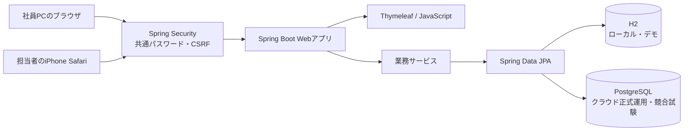
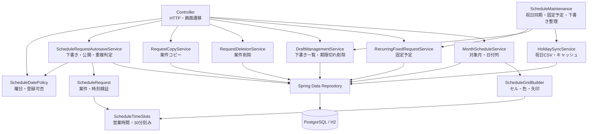

# システム構成

## 全体構成

```mermaid
flowchart LR
    PC["社員PCのブラウザ"]
    IPHONE["担当者のiPhone Safari"]
    SECURITY["Spring Security\n共通パスワード・CSRF"]
    WEB["Spring Boot Webアプリ"]
    VIEW["Thymeleaf / JavaScript"]
    SERVICE["業務サービス"]
    JPA["Spring Data JPA"]
    H2[("H2\nローカル・デモ")]
    PG[("PostgreSQL\nクラウド正式運用・競合試験")]

    PC --> SECURITY
    IPHONE --> SECURITY
    SECURITY --> WEB
    WEB --> VIEW
    WEB --> SERVICE
    SERVICE --> JPA
    JPA --> H2
    JPA --> PG
```

利用者はインストールせず、同じURLをブラウザで開く。個人別ログインや権限差は設けない。社員5人程度による受入テストを経て、正式運用では10人弱が1つのスケジュールを共同利用する。クラウド配置時だけ、URL漏洩時の最低限の入口制限として共通パスワードゲートを使う。

## アプリケーション内の責務

```mermaid
flowchart TD
    CONTROLLER["Controller\nHTTP・画面遷移"]
    POLICY["ScheduleDatePolicy\n曜日・登録可否"]
    TIME_SLOTS["ScheduleTimeSlots\n営業時間・30分刻み"]
    AUTOSAVE["ScheduleRequestAutosaveService\n下書き・公開・重複判定"]
    REQUEST["ScheduleRequest\n案件・時刻検証"]
    COPY["RequestCopyService\n案件コピー"]
    DELETE["RequestDeletionService\n案件削除"]
    DRAFT["DraftManagementService\n下書き一覧・期限切れ削除"]
    RECURRING["RecurringFixedRequestService\n固定予定"]
    MAINTENANCE["ScheduleMaintenance\n祝日同期・固定予定・下書き整理"]
    HOLIDAY["HolidaySyncService\n祝日CSV・キャッシュ"]
    MONTH["MonthScheduleService\n対象月・日付列"]
    GRID["ScheduleGridBuilder\nセル・色・矢印"]
    REPOSITORY["Spring Data Repository"]
    DB[("PostgreSQL / H2")]

    CONTROLLER --> POLICY
    CONTROLLER --> AUTOSAVE
    CONTROLLER --> COPY
    CONTROLLER --> DELETE
    CONTROLLER --> DRAFT
    CONTROLLER --> RECURRING
    CONTROLLER --> MONTH
    AUTOSAVE --> POLICY
    AUTOSAVE --> REQUEST
    REQUEST --> TIME_SLOTS
    AUTOSAVE --> REPOSITORY
    COPY --> REPOSITORY
    DELETE --> REPOSITORY
    DRAFT --> REPOSITORY
    RECURRING --> REPOSITORY
    MAINTENANCE --> RECURRING
    MAINTENANCE --> DRAFT
    MAINTENANCE --> HOLIDAY
    HOLIDAY --> REPOSITORY
    MONTH --> REPOSITORY
    MONTH --> GRID
    GRID --> TIME_SLOTS
    REPOSITORY --> DB
```

主要なDBテーブルは、案件と下書きの`schedule_requests`、祝日の`calendar_holidays`、休みの`schedule_day_offs`、削除した固定予定を再作成しないための`recurring_fixed_request_skips`である。

## 保存と競合制御

1. 入力欄を離れた時点でJavaScriptが自動保存APIを呼ぶ
2. 依頼者名と時間範囲がそろわない入力は下書きとして保持する
3. 一覧反映条件を満たす入力は、同日の既存案件と時間範囲を照合する
4. 重複がなければ公開し、重複時は理由付き下書きとして入力値を保持する
5. PostgreSQLでは排他制約を最終防衛線とし、同時登録でも先着案件だけを公開する
6. 編集は楽観ロック、キャンセルは確認時のバージョン照合により他者の更新を保護する

状態変更POSTはSpring SecurityのCSRF防御を通す。通常フォームにはThymeleafがトークンを追加し、自動保存JavaScriptは同じトークンをHTTPヘッダーへ設定する。PostgreSQLの時間重複はSQLSTATE `23P01`だけを競合として扱い、ほかのDB整合性エラーは障害として伝播させる。

## 定期保守

`ScheduleMaintenance`は起動時と、アプリ稼働中の毎日3時（日本時間）に、祝日同期、今月・翌月の固定予定作成、期限切れ下書き削除を順番に実行する。停止中に3時を過ぎた場合は、次回起動時に実行する。祝日同期が失敗し、既存キャッシュもない場合は固定予定を作らない。月間一覧のGETは表示データの取得だけを行う。休み解除時は、現在月または翌月の対象日だけ固定予定を即時補充する。

固定予定は水曜日8:30-10:00の入庫と金曜日8:30-10:00の商品管理で、通常案件と同じ `schedule_requests` に保存する。個別削除した日は `recurring_fixed_request_skips` で再作成を抑止し、表示時は通常案件と異なる専用色を割り当てる。

## 環境の使い分け

| 環境 | DB | 用途 |
| --- | --- | --- |
| 通常ローカル | H2ファイル | 日常開発、再起動後のデータ保持 |
| デモ | 専用H2ファイル | 架空案件6件を使った画面・操作確認 |
| 自動テスト | H2メモリ | 単体、結合、ブラウザE2E、性能・容量確認 |
| DB競合試験 | PostgreSQL Testcontainers | 排他制約、同時登録、トランザクション確認 |
| 10人弱の正式運用 | Render Free Web Service + Neon Free PostgreSQL | 実在案件、共通パスワードゲート、PostgreSQL保存、日次バックアップ。速度改善要望が出た場合だけ有料化を検討 |

デモと自動テストでは `ScheduleMaintenance` を無効にし、デモデータ投入やテスト結果を起動順序と外部祝日CSVから切り離す。cloud profileでは共通パスワードゲートを必須とし、無効設定では起動を失敗させる。
