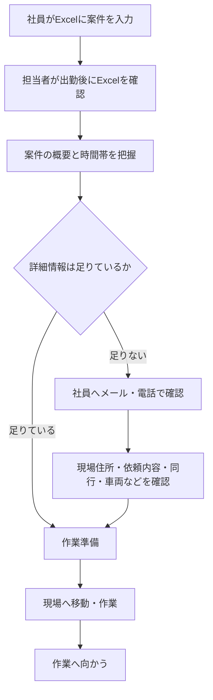
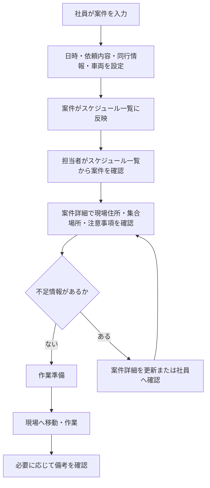

# 業務フロー

## As-Is: 現行業務

現行業務では、社員が共有Excelに案件を入力し、配送・設置担当者が出勤後に当日の予定を確認する。その後、Excelに不足している情報を社員へ個別確認してから作業に向かう。

## As-Isの課題ポイント

| 工程 | 課題 |
| --- | --- |
| 案件入力 | セル内に詳細を書き切れない |
| 予定確認 | 1件ごとの詳細画面がなく、確認先が分散する |
| 個別確認 | メールや電話により確認時間が発生する |
| 作業準備 | 依頼内容、車両、集合情報の抜け漏れが起きやすい |
| 変更対応 | 誰がいつ何を変更したか分かりにくい |

## To-Be: Webシステム導入後

Webシステムでは、社員が案件登録時に必要情報を構造化して入力する。担当者はスケジュール一覧から案件詳細へ移動し、当日の作業に必要な情報を確認する。

## 主要業務フロー

### 1. 案件登録

1. 社員が案件入力フォームを開く
2. 作業日、開始時間、終了時間を入力する
3. 依頼者名、作業場所、作業種別を入力する
4. 同行が必要な場合のみ同行ありチェックを付ける
5. 依頼内容、現場住所、到着希望時間、備考を入力する
6. 同行ありチェックを付けた場合は集合場所、出発時間、使用車両を入力する
7. 依頼者名、開始時間、終了時間がそろうとスケジュール一覧に反映される

### 2. 当日確認

1. 担当者がスケジュール一覧を開く
2. 今日の案件を表示する
3. 案件詳細画面で作業に必要な情報を確認する
4. 不足情報があれば、案件メモや更新依頼で確認する

### 3. 案件変更

1. 社員が対象案件を開く
2. 日時、依頼内容、同行情報、車両などを変更する
3. 変更後の内容がスケジュール一覧と案件詳細に反映される

### 4. 依頼キャンセル

1. 利用者が対象案件を開く
2. 依頼キャンセルボタンを押す
3. 二重確認の確認ダイアログを表示する
4. キャンセル後、案件データを物理削除し、該当セルが未入力状態に戻る

### 5. 休み・日付列の管理

1. 利用者が対象月のスケジュール一覧を開く
2. 出勤できない水曜日・金曜日は、日付見出しから休みに設定する
3. 対象日に既存案件がある場合は、その日の案件をすべて物理削除する
4. 休みの日は先頭セルに `休み` と表示され、全時間帯への案件入力が禁止される
5. 出勤可能に戻った場合は休みを解除する
6. 祝日などで列自体が不要な場合は、日付見出しから対象日を一覧の非表示対象にする

### 6. 案件を別日へコピー

1. 利用者がコピー元の案件入力・編集フォームを開く
2. フォーム上部の `この入力内容をほかの日時にコピーする` を押す
3. 日付を直接入力するか、簡易スケジュール表の日付をクリックしてコピー先を選ぶ
4. 日付以外の入力値が入った新規フォームを開く
5. コピー先の同じ時間帯に既存案件がなければ、新規案件として保存する
6. 時間帯が重なる場合は保存せず、コピー内容を残したまま重複エラーを表示する
7. 必要に応じて開始時間・終了時間を修正して保存する
8. コピー元の案件はそのまま残す

## 利用者別の関わり方

MVPではログインや権限差を設けない。社員も配送・設置担当者も、同じ画面を同じ権限で利用する。

| 利用者 | 登録 | 編集 | 閲覧 | 依頼キャンセル |
| --- | --- | --- | --- | --- |
| 社員 | 可 | 可 | 可 | 可 |
| 配送・設置担当者 | 可 | 可 | 可 | 可 |

## MVPで重視する業務フロー

MVPでは、次のフローを優先する。

- 社員が案件を登録する
- 担当者がスケジュール一覧から案件を確認する
- 案件詳細で必要情報を確認する

通知や外部連携がなくても、Excelセルに収まらない情報を案件詳細として管理できる状態を最初の到達点とする。
