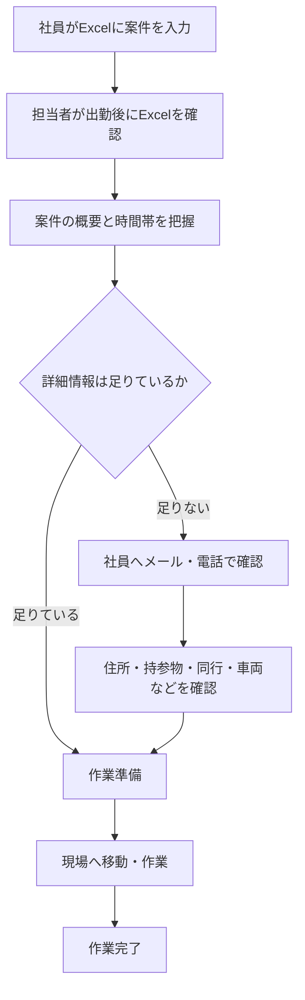
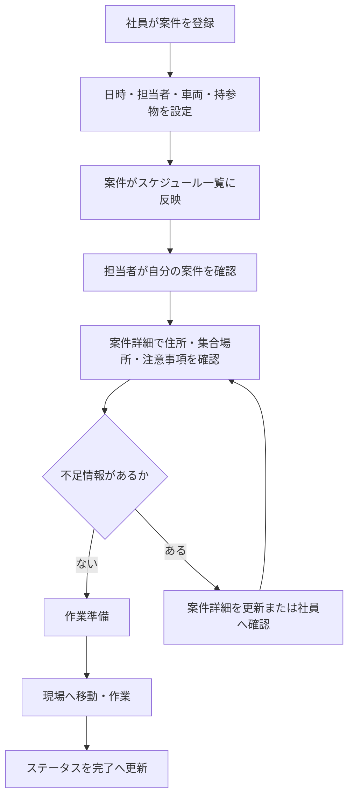

# 業務フロー

## As-Is: 現行業務

現行業務では、社員が共有Excelに案件を入力し、配送・設置担当者が出勤後に当日の予定を確認する。その後、Excelに不足している情報を社員へ個別確認してから作業に向かう。

## As-Isの課題ポイント

| 工程 | 課題 |
| --- | --- |
| 案件入力 | セル内に詳細を書き切れない |
| 予定確認 | 1件ごとの詳細画面がなく、確認先が分散する |
| 個別確認 | メールや電話により確認時間が発生する |
| 作業準備 | 持参物、車両、集合情報の抜け漏れが起きやすい |
| 変更対応 | 誰がいつ何を変更したか分かりにくい |

## To-Be: Webシステム導入後

Webシステムでは、社員が案件登録時に必要情報を構造化して入力する。担当者はスケジュール一覧から案件詳細へ移動し、当日の作業に必要な情報を確認する。

## 主要業務フロー

### 1. 案件登録

1. 社員が案件登録画面を開く
2. 作業日、開始時間、終了時間を入力する
3. 顧客名、作業場所、作業区分を入力する
4. 主担当、同行者、使用車両を設定する
5. 持参物、回収物、注意事項を入力する
6. 登録後、スケジュール一覧に反映される

### 2. 当日確認

1. 担当者がログインする
2. 今日の案件または自分の担当案件を表示する
3. 案件詳細画面で作業に必要な情報を確認する
4. 不足情報があれば、案件メモや更新依頼で確認する
5. 準備完了後、ステータスを確認済みに更新する

### 3. 案件変更

1. 社員が対象案件を開く
2. 日時、担当者、車両、持参物などを変更する
3. 更新理由や補足メモを残す
4. 変更後の内容がスケジュール一覧と案件詳細に反映される

### 4. 作業完了

1. 担当者が作業完了後に案件詳細を開く
2. ステータスを完了へ更新する
3. 必要に応じて完了メモを入力する
4. 完了案件として履歴に残る

## ユーザー別の関わり方

| ユーザー | 登録 | 編集 | 閲覧 | 完了更新 | マスタ管理 |
| --- | --- | --- | --- | --- | --- |
| 管理者 | 可 | 可 | 可 | 可 | 可 |
| 社員 | 可 | 可 | 可 | 可 | 一部可 |
| 配送・設置担当者 | 原則不可 | 一部可 | 可 | 可 | 不可 |

## MVPで重視する業務フロー

MVPでは、次のフローを優先する。

- 社員が案件を登録する
- 担当者が自分の案件を確認する
- 案件詳細で必要情報を確認する
- 作業後にステータスを更新する

通知や外部連携がなくても、Excelセルに収まらない情報を案件詳細として管理できる状態を最初の到達点とする。
