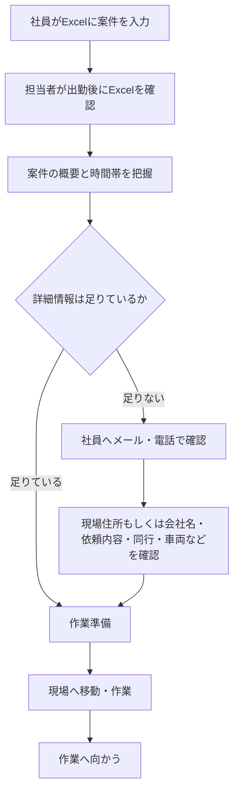
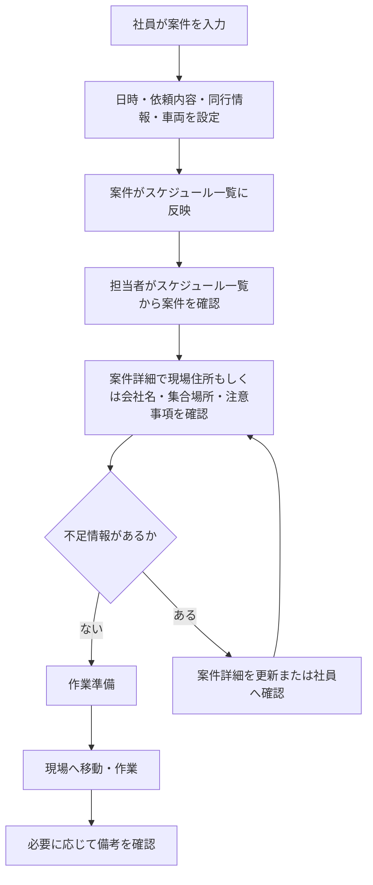

# 業務フロー

## As-Is: 現行業務

現行業務では、社員が共有Excelに案件を入力し、配送・設置担当者が出勤後に当日の予定を確認する。その後、Excelに不足している情報を社員へ個別確認してから作業に向かう。

## As-Isの課題ポイント

| 工程 | 課題 |
| --- | --- |
| 案件入力 | セル内に詳細を書き切れない |
| 予定確認 | 1件ごとの詳細画面がなく、確認先が分散する |
| 個別確認 | メールや電話により確認時間が発生する |
| 作業準備 | 依頼内容、車両、集合情報の抜け漏れが起きやすい |
| 変更対応 | 誰がいつ何を変更したか分かりにくい |

## To-Be: Webシステム導入後

Webシステムでは、社員が案件登録時に必要情報を構造化して入力する。担当者はスケジュール一覧から案件詳細へ移動し、当日の作業に必要な情報を確認する。

## 主要業務フロー

### 1. 案件登録

1. 社員が案件入力フォームを開く
2. 作業日はクリックした空白セルの日付を引き継ぎ、開始時間、終了時間を入力する
3. 作業種別を入力し、設置、回収、交換、配達では依頼者名も入力する
4. 依頼者名の直後にある同行ありチェックを、同行が必要な場合のみ付ける
5. 依頼内容、現場住所もしくは会社名、顧客先到着希望時間、備考を入力する。同行ありの場合、現場住所もしくは会社名は任意とする
6. 同行ありチェックを付けた場合は集合場所、出発時間を入力し、必要な場合だけ使用車両を指定する
7. 入力欄から離れるたびに入力内容を自動保存する
8. 依頼者名と時間範囲がそろうと重複を再確認する。入庫、商品管理では依頼者名を任意とし、時間範囲と作業種別がそろった時点で重複を再確認する
9. 空いていれば内部状態を `PUBLISHED` として一覧へ反映し、入力不足または時間重複の場合は `DRAFT` として理由付きで保持する
10. 保存失敗時は入力値を画面に残し、赤字エラーと再試行操作を表示する

入庫、商品管理も同じ入力フォームから手動登録し、開始時間、終了時間、作業種別を入力する。依頼者名は任意とする。

### 2. 当日確認

1. 担当者がスケジュール一覧を開く
2. 現在月の一覧から当日の案件を確認する
3. 案件詳細画面で作業に必要な情報を確認する
4. 不足情報があれば、案件入力・編集フォームを更新するか依頼者へ連絡する

### 3. 案件変更

1. 社員が対象案件を開く
2. 日時、依頼内容、同行情報、車両などを変更する
3. 一覧反映条件が有効で、時間重複がなければ変更後の内容を保存する
4. 一覧反映項目を編集中に一時的に消した場合はDBへ保存せず、元の公開済み案件と時間枠を維持して不足を表示する
5. 時間変更が既存案件と重複した場合も元の公開済み案件と時間枠を維持する
6. 有効な一覧反映条件が再びそろった時点で変更後の内容をスケジュール一覧と案件詳細に反映する

### 4. 依頼キャンセル

1. 利用者が対象案件を開く
2. 依頼キャンセルボタンを押す
3. 二重確認の確認ダイアログを表示する
4. キャンセル後、案件データを物理削除し、該当セルが未入力状態に戻る

### 5. 下書きの再開・削除

1. 利用者が月間一覧上部の下書き一覧を開く
2. 日付、入力済みの依頼者名、最終更新日時、下書き理由から対象の下書きを選ぶ
3. `入力を再開` で案件入力フォームを開く
4. 不要な下書きは確認後に物理削除する
5. 作業種別ごとの一覧反映条件がそろった場合は重複を再確認する
6. 空いていれば `PUBLISHED` として一覧へ反映し、重複していれば `DRAFT` のまま入力値と競合時間帯を残してエラーを表示する
7. 下書き一覧を開く際、日本時間で作業日を過ぎた下書きを自動で物理削除する

下書きの状態では時間枠を確保しない。作業日を過ぎて自動削除された下書きは復元しない。

### 6. 同時登録

1. 複数の利用者が同じ日の時間帯へ案件を入力する
2. 保存処理内で既存案件との重複を再確認する
3. 先にコミットした案件だけを `PUBLISHED` として採用する
4. 後続は `PUBLISHED` への変更を拒否し、競合した時間帯を含むエラーを表示する
5. 後続の入力値は `DRAFT` として保持し、下書き一覧にも未反映理由を表示する
6. 既存案件の時間変更では元の時間枠を維持し、変更値を画面に残してエラーを表示する

## MVP後の業務候補

- 外部祝日カレンダーと同期し、祝日の日付列を一覧生成時に除外する
- 日付単位の休み設定を行う
- 既存案件の入力内容を別日へコピーする
- 左上の年月選択から任意の月へ移動する
- 生成AIに使い方を質問し、確認付きで案件入力を支援させる

## 利用者別の関わり方

MVPではログインや権限差を設けない。約10人の社員と配送・設置担当者が、現行の共有Excelと同様に1つのスケジュールを同じ権限で利用する。

| 利用者 | 登録 | 編集 | 閲覧 | 依頼キャンセル |
| --- | --- | --- | --- | --- |
| 社員 | 可 | 可 | 可 | 可 |
| 配送・設置担当者 | 可 | 可 | 可 | 可 |

## MVPで重視する業務フロー

MVPでは、次のフローを優先する。

- 社員が案件を登録する
- 担当者がスケジュール一覧から案件を確認する
- 案件詳細で必要情報を確認する

通知や祝日カレンダー連携がなくても、Excelセルに収まらない情報を案件詳細として管理できる状態を最初の到達点とする。
