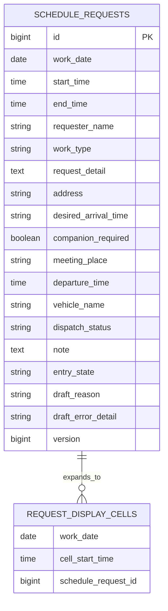

# データベース設計

## 設計方針

個人別ログイン、ユーザー識別、権限管理、案件の業務ステータス管理は行わない。クラウド配置時の共通Basic認証はアプリ利用者の識別ではなく、外側の入口制限として扱う。現行Excelに近い軽い運用を優先し、案件情報を1件単位で保存する。一覧反映可否を管理する技術状態としてのみ `DRAFT` と `PUBLISHED` を持つ。通常の水曜日・金曜日は年月から算出し、休み設定と日本の祝日取得はMVP後に追加する。

Excelの1セルにまとめられていた情報を、検索・表示・重複チェックしやすいデータ構造に分ける。ローカル起動にはH2を使用し、本番想定DBにはPostgreSQLを採用する。時間重複、同時登録、PostgreSQL固有制約はTestcontainers上のPostgreSQLで検証する。

## 概念モデル

補足:

- `REQUEST_DISPLAY_CELLS` は物理テーブルではなく、画面表示時に展開される概念として扱う。
- 実DBでは、案件の `work_date`、`start_time`、`end_time` をもとに30分セルへ展開する。
- 入力済みセルをクリックした場合は、展開されたセルから元の `schedule_requests.id` を特定し、既存案件の入力・編集フォームを開く。

## テーブル一覧

| テーブル | 目的 | MVP |
| --- | --- | --- |
| schedule_requests | 案件の日時と詳細情報を管理する | 対象 |

将来拡張で検討するテーブル:

| テーブル | 目的 |
| --- | --- |
| vehicles | 車両マスタを導入する場合に車両を管理する |
| audit_logs | 変更履歴を詳細に管理する |
| attachments | 写真や資料を管理する |
| notifications | 通知履歴を管理する |
| schedule_day_offs | 個人的に出勤できない水曜・金曜の休みを管理する |
| calendar_holidays | 外部カレンダーから取得した日本の祝日をキャッシュする |

## schedule_requests

| カラム | 型 | 制約 | 説明 |
| --- | --- | --- | --- |
| id | BIGINT | PK | 案件ID |
| work_date | DATE | NOT NULL | 作業日。新規入力時はクリックした空白セルの日付 |
| start_time | TIME | NULL | 開始時間 |
| end_time | TIME | NULL | 終了時間 |
| requester_name | VARCHAR(100) | NULL | 依頼者名。自由入力。入庫、商品管理では任意 |
| work_type | VARCHAR(30) | NULL | INSTALL, COLLECT, EXCHANGE, DELIVERY, RECEIVING, PRODUCT_MANAGEMENT |
| request_detail | TEXT | NULL | 依頼内容。機種、台数、内容物などをまとめて記入する |
| address | VARCHAR(500) | NULL | 現場住所もしくは会社名。サンプルでは架空情報のみ使用 |
| desired_arrival_time | VARCHAR(100) | NULL | 顧客先到着希望時間。`10:00`、`午前中`、`午後かつ17時まで`、`時間指定なし` などを自由入力 |
| companion_required | BOOLEAN | NOT NULL, DEFAULT FALSE | 同行ありチェック |
| meeting_place | VARCHAR(300) | NULL | 同行ありの場合の集合場所 |
| departure_time | TIME | NULL | 同行ありの場合の出発時間 |
| vehicle_name | VARCHAR(100) | NULL | 同行ありの場合の任意の使用車両指定 |
| dispatch_status | VARCHAR(30) | NOT NULL, DEFAULT `UNANSWERED` | UNANSWERED, REQUIRED, DISPATCHED |
| note | TEXT | NULL | 備考。受付、搬入口、現地担当者への連絡、注意事項などをまとめる |
| entry_state | VARCHAR(20) | NOT NULL, DEFAULT `DRAFT` | DRAFT, PUBLISHED。一覧反映可否を表す技術状態 |
| draft_reason | VARCHAR(30) | NULL | INCOMPLETE, TIME_CONFLICT。PUBLISHEDではNULL |
| draft_error_detail | VARCHAR(500) | NULL | 不足項目や直近の競合時間帯など、下書き一覧へ表示する理由。PUBLISHEDではNULL |
| version | BIGINT | NOT NULL, DEFAULT 0 | 同一案件の同時更新を検知する楽観ロック用バージョン |
| created_at | TIMESTAMP | NOT NULL | 作成日時 |
| updated_at | TIMESTAMP | NOT NULL | 更新日時 |

補足:

- 入庫、商品管理も `schedule_requests` に保存し、定例データとして自動生成しない。
- 入庫、商品管理では `requester_name` を任意とし、`start_time`、`end_time`、`work_type` がそろった時点で重複チェックを行う。
- 入庫、商品管理では `start_time`、`end_time`、`work_type` だけを必須とし、その他のNULLを未入力警告の対象にしない。
- `companion_required` をFALSEへ変更した場合は、`meeting_place`、`departure_time`、`vehicle_name` をNULLへ戻す。
- 通常作業から入庫・商品管理へ変更する際は画面で確認し、承認後に依頼内容、現場住所もしくは会社名、顧客先到着希望時間、同行関連値、備考をNULLへ戻し、出庫状態を `UNANSWERED` へ戻す。依頼者名は任意項目として保持する。
- 一覧へ反映済みの通常案件は初期MVPでは自動削除せず保持する。フェーズ6のクラウド配置では、作業日から1か月を過ぎた `schedule_requests` を `DRAFT` / `PUBLISHED` の状態にかかわらず物理削除する。

## 下書きの扱い

- 最初の入力値を保存した時点で `schedule_requests` を作成する。入力がないままフォームを離れた場合はレコードを作成しない。
- 文字入力項目は前後の空白を除去し、空文字だけの場合はNULLへ正規化する。
- 新規レコードは `entry_state = DRAFT` で作成する。
- `work_type` が入庫、商品管理以外または未入力の場合は `requester_name`、`start_time`、`end_time`、入庫、商品管理の場合は `start_time`、`end_time`、`work_type` がそろい、時間重複がなければ `PUBLISHED` へ変更する。作業種別が未入力でも、それだけを理由に `＊未入力` の対象とはしない。
- 一覧反映条件の不足時は `draft_reason = INCOMPLETE`、時間重複時は `draft_reason = TIME_CONFLICT` とする。
- `draft_error_detail` には不足項目または直近の競合時間帯を保存し、下書き一覧へ理由を表示する。
- 下書き一覧は `work_date`、入力済みの `requester_name`、`updated_at`、`draft_reason`、`draft_error_detail` を表示する。
- 下書き一覧は `work_date` が日本時間の現在日付以降である全月の下書きを対象とし、`updated_at` の降順で取得する。
- `DRAFT` は時間枠を確保しない。一覧反映条件がそろう保存処理で重複を再確認する。
- 重複時はレコードを下書きのまま保持し、入力値を失わない。
- 利用者が下書き削除を確認した場合は物理削除する。
- 下書き一覧を取得するトランザクションの先頭で、`work_date` が日本時間の現在日付より前である下書きを物理削除する。
- 自動削除した下書きの復元用レコードや削除履歴は保持しない。

## データ保持期間

フェーズ6のクラウド配置では、無料PostgreSQLの容量を抑え、業務情報を長期間残さないために、作業日を基準とした自動物理削除を行う。

- 日本時間 `Asia/Tokyo` の現在日付を基準に、`work_date` が現在日付の1か月前より古いデータを削除対象とする。
- 削除対象は `schedule_requests` の `DRAFT` と `PUBLISHED`、および休み設定テーブルの対象日レコードとする。
- `calendar_holidays` は祝日キャッシュであり、保持期間削除の対象外とする。
- 今日以降の未来予定と、作業日から1か月以内のデータは削除しない。
- 自動削除はアプリ起動時または日次処理で実行し、削除件数だけをログへ出す。住所、顧客名、依頼内容などの業務情報はログへ出さない。
- 自動削除したレコードの復元用レコードや削除履歴は保持しない。実在案件の入力前には別途バックアップと復元手順を確認する。

## 同時登録方針

- 重複確認と保存を一体の処理として行い、同じ時間帯では先にコミットした案件を採用する。
- 後続処理は `PUBLISHED` への変更を行わず、入力値を `DRAFT` として保持し、競合した日付と時間帯を含むエラーを返す。
- 同一案件の同時編集は `version` により検知し、古い画面からの上書きを拒否する。
- 同一案件の同時編集を拒否した場合も、利用者が入力した画面上の値は保持し、最新情報の再読込を促す。
- 具体的なトランザクション分離レベルとロック方式は、採用DBを決定する技術設計時に確定する。

## インデックス・制約初期案

- 月間一覧取得と重複確認のため、`schedule_requests(work_date, start_time, end_time)` に複合インデックスを設定する。
- 保持期間削除のため、`schedule_requests(work_date)` と休み設定テーブルの日付キーで削除対象を効率よく抽出できるようにする。
- `dispatch_status` は `UNANSWERED`、`REQUIRED`、`DISPATCHED` だけを許可する。
- `entry_state` は `DRAFT`、`PUBLISHED`、`draft_reason` はNULL、`INCOMPLETE`、`TIME_CONFLICT` だけを許可する。
- 時刻範囲、30分単位、作業種別、同行条件はService層で検証し、採用DBで無理なく表現できる制約はDBにも追加する。
- `created_at`、`updated_at`、`version` はアプリケーションから一貫して更新する。

## MVP後: schedule_day_offs

対象月の水曜日・金曜日はレコードなしでも通常日として表示する。個人的に出勤できない日のみ、休みレコードを保存する。

| カラム | 型 | 制約 | 説明 |
| --- | --- | --- | --- |
| work_date | DATE | PK | 対象日 |
| created_at | TIMESTAMP | NOT NULL | 作成日時 |
| updated_at | TIMESTAMP | NOT NULL | 更新日時 |

- 休みの日は日付列を残し、先頭セルに `休み`、全時間セルに休み専用色を表示する。案件の新規入力と保存を禁止する。
- 休みを解除する場合は例外レコードを削除し、通常の勤務予定日に戻す。
- 休み設定前に対象日の `PUBLISHED` と `DRAFT` の件数をそれぞれ取得し、確認画面へ削除件数として表示する。
- 利用者の確認後、同一トランザクション内で対象日の `schedule_requests` をすべて物理削除してから休みレコードを保存する。
- 全案件削除と休みレコード保存の一方が失敗した場合は、処理全体をロールバックする。
- 公開案件または下書きがある場合は二段階確認、どちらもない場合は一段階確認とする。休み解除も一段階確認とする。
- 削除された案件と下書きの復元用レコードや履歴は保持しない。

## MVP後: calendar_holidays

外部の日本祝日カレンダーから取得した祝日を保存する。月間一覧を開くたびに外部サービスへ問い合わせるのではなく、キャッシュした値を一覧生成と入力検証に利用する。

| カラム | 型 | 制約 | 説明 |
| --- | --- | --- | --- |
| holiday_date | DATE | PK | 祝日の日付 |
| holiday_name | VARCHAR(100) | NOT NULL | 祝日名 |
| source | VARCHAR(100) | NOT NULL | 取得元の識別子 |
| synced_at | TIMESTAMP | NOT NULL | 最終取得日時 |

- 月間一覧は対象月の水曜日・金曜日から `calendar_holidays` に存在する日を除外して生成する。
- 祝日は案件の新規登録、更新、コピー先指定、休み設定の対象にできない。
- 祝日には案件が入らない運用を前提とし、祝日と判定した日付列を一覧生成時に除外する。
- 祝日同期を理由に `schedule_requests` を自動削除しない。
- 外部カレンダーの取得に失敗した場合は、DBに保存済みの前回取得データをそのまま使用する。
- 取得に失敗し、保存済みデータもない場合は、祝日除外を行わず水曜日・金曜日を通常表示する。外部サービスの障害だけを理由に一覧表示や案件入力を停止しない。
- 取得元は政府の公式公開データを優先し、実装前に利用条件とデータ形式を確認する。民間APIやGoogleカレンダーへは依存しない。
- アプリ起動時にキャッシュ期限を確認し、古い場合だけ自動同期する。一覧表示ごとの外部通信と手動同期操作は行わない。キャッシュ期限の具体値は設定値として実装時に決定する。
- 祝日に案件を入れる運用はない前提とし、祝日列は一覧から除外する。祝日同期を理由に案件データを自動削除する処理や、`祝日・登録あり` の例外表示は作らない。

## MVP後: 案件コピー方針

- コピーは既存レコードの更新ではなく、新しい `schedule_requests.id` を持つ新規案件として扱う。
- `work_date` はコピー先として選択した日付を使う。
- フォーム入力値だけをコピーし、`id`、`work_date`、`entry_state`、`draft_reason`、`draft_error_detail`、`version`、`created_at`、`updated_at` はコピーしない。コピー先は `DRAFT` から検証する。
- コピー元の案件レコードは変更、削除しない。
- コピー元は `PUBLISHED` の案件だけとし、`DRAFT` はコピー元にできない。コピー元と同じ日へのコピーも許可しない。
- コピー先選択を確定した時点で新規案件の保存を試みる。重複がなければ保存した案件のフォームを開く。
- コピーした開始時間・終了時間がコピー先の既存案件と重なる場合、新規レコードを保存しない。
- 重複時はDBへ新規レコードを作らず、コピー値と赤字エラーを画面上に残して開始時間・終了時間を修正できるようにする。

## 過去日の変更制限

- アプリケーションが日本時間 `Asia/Tokyo` で取得した現在日付を基準に、`work_date` が現在日付より前の場合は過去日として扱う。
- 過去日の一覧と案件詳細は取得できるが、新規作成、更新、物理削除を拒否する。
- 画面上の無効化だけに依存せず、Service層でも過去日への変更を検証する。
- 今日以降の日付は編集可能とする。
- データルール上は未来月の登録上限を設けない。ただし、初期MVPの画面から移動できる未来月は翌月までとする。
- MVPでは、未来日でも水曜日・金曜日であることを検証する。休み・祝日の検証は各機能の追加時に実装する。

## 一覧反映条件

スケジュール一覧へ案件を表示する条件:

- `entry_state = PUBLISHED` である
- `work_type` が入庫、商品管理以外または未入力の場合は `requester_name`、`start_time`、`end_time` が入力されている
- 入庫、商品管理では `start_time`、`end_time`、`work_type` が入力されている。`requester_name` は任意

新規入力または既存下書きが一覧反映条件を満たさない場合、または時間重複がある場合は `entry_state = DRAFT` とし、一覧には表示しない。

公開済み案件の編集では、一覧反映条件が一時的に欠けてもDB上の値を `DRAFT` へ変更しない。変更を保存せず元の `PUBLISHED` レコードと時間枠を維持し、画面上の入力値だけを残して不足項目を表示する。有効な一覧反映条件が再びそろい、重複がない場合に公開済みレコードを更新する。

## 必須チェック

全作業種別で必須:

- 開始時間
- 終了時間
- 作業種別

設置、回収、交換、配達で必須:

- 依頼内容
- 現場住所もしくは会社名（同行なしの場合）
- 依頼者名
- 顧客先到着希望時間

補足:

- 顧客先到着希望時間は開始時間・終了時間とは異なり、厳密な時刻型にはしない。
- 顧客との約束が `午前中`、`午後かつ17時まで`、`なるべく早め` のような表現になることがあるため、自由入力の文字列として扱う。

設置、回収、交換、配達で条件付き必須:

- 同行ありチェックを付けた場合、集合場所を必須にする
- 同行ありチェックを付けた場合、出発時間を必須にする
- 同行ありチェックを付けた場合、現場住所もしくは会社名は任意にする
- 同行ありチェックを付けた場合、使用車両の指定を任意入力できる
- 同行ありチェックが付いていない場合、集合場所、出発時間、使用車両の指定は未設定として扱う

入庫、商品管理では、上記の通常作業向け必須項目と条件付き必須項目がNULLでも、`＊未入力` やフォーム上部の不足警告を表示しない。

## 時間範囲の制約

- 終了時間は開始時間より後であること
- 時間は30分単位で扱う
- スケジュール表の表示時間帯は8:30-17:30固定とする
- 開始時間・終了時間は8:30-17:30内のみ許可する
- 同じ作業日の既存案件と時間範囲が重なる場合、入力を無効にする
- 時間範囲は開始時刻を含み終了時刻を含まない半開区間として判定し、既存案件が12:00-14:00の場合は14:00開始を重複としない
- 新規入力が重複した場合は `DRAFT` として入力値、`TIME_CONFLICT`、競合時間帯を保持する
- 既存案件の時間変更が重複した場合は変更を保存せず、元の `PUBLISHED` レコードと時間枠を維持する
- 必須詳細項目が未入力で `＊未入力` 表示になっている案件も、重複チェック上は通常の案件として扱う
- 重複時は `その時間はすでに埋まっています` のような注意表示を出す

重複例:

| 既存案件 | 新規入力 | 判定 |
| --- | --- | --- |
| 9:00-11:00 | 10:00-12:00 | 重複 |
| 9:00-11:00 | 11:00-12:00 | 重複なし |
| 13:00-14:00 | 12:00-13:00 | 重複なし |

## キャンセル方針

MVPではキャンセル済みステータスを持たない。

`PUBLISHED` の依頼キャンセル時は二重確認後に案件レコードを物理削除する。削除後は、該当時間帯のセルを未入力扱いに戻す。`DRAFT` は確認1回で物理削除する。

変更履歴や復元が必要になった場合は、将来拡張でキャンセル履歴や監査ログを検討する。

## 正式運用前のバックアップ方針

DBバックアップ機能は初期MVPの完成条件に含めない。ただし、実在案件を入力する前に、PostgreSQLの正式配置先に合わせてバックアップ方法と保管先を決定し、架空データを使った復元テストを行う。復元できることを確認するまでは正式運用へ移行しない。

## 初期サンプルデータ方針

サンプルデータは全て架空情報で作成する。

ポートフォリオで画面の動きを説明しやすくするため、1日あたり3件程度の案件を基本にし、設置、回収、交換、配達、入庫、商品管理の作業種別を一通り含める。

現場住所をサンプルへ入力する場合は、名古屋市、豊田市、岡崎市、一宮市など愛知県内の市に限定する。会社名、番地、建物名、顧客名、担当者名は実在情報を使わず、架空表現にする。

| 種別 | 例 |
| --- | --- |
| 依頼者名 | 社員A、社員B |
| 住所 | 愛知県名古屋市サンプル区1-2-3、愛知県豊田市サンプル町4-5 |
| 車両 | 車両A、車両B |
| 依頼内容 | コーヒーサーバー一式の設置、ウォーターサーバー本体の回収、既存機器の交換、備品の配達 |

## 今後の検討事項

- 5Cで使用する政府公式データの具体的なURL・ファイル形式と、キャッシュ期限の設定値
- 車両を自由入力にするか、将来的にマスタ化するか
- 変更履歴をどのタイミングで導入するか
- 生成AIを導入する場合のローカル実行環境、モデル、確認付き操作方式。会社承認なしに実データを外部送信しない
