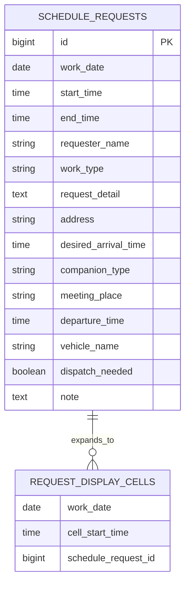

# データベース設計

## 設計方針

MVPでは、ログイン、ユーザー識別、権限管理、ステータス管理を行わない。現行Excelに近い軽い運用を優先し、案件情報を1件単位で保存する。

Excelの1セルにまとめられていた情報を、検索・表示・重複チェックしやすいデータ構造に分ける。DB製品は後続工程で決定するが、開発初期はH2、本番想定はPostgreSQLまたはMySQLを候補とする。

## 概念モデル

補足:

- `REQUEST_DISPLAY_CELLS` は物理テーブルではなく、画面表示時に展開される概念として扱う。
- 実DBでは、案件の `work_date`、`start_time`、`end_time` をもとに30分セルへ展開する。

## テーブル一覧

| テーブル | 目的 | MVP |
| --- | --- | --- |
| schedule_requests | 案件の日時と詳細情報を管理する | 対象 |

将来拡張で検討するテーブル:

| テーブル | 目的 |
| --- | --- |
| users | ログインや権限管理を導入する場合に利用者を管理する |
| vehicles | 車両マスタを導入する場合に車両を管理する |
| audit_logs | 変更履歴を詳細に管理する |
| attachments | 写真や資料を管理する |
| notifications | 通知履歴を管理する |

## schedule_requests

| カラム | 型 | 制約 | 説明 |
| --- | --- | --- | --- |
| id | BIGINT | PK | 案件ID |
| work_date | DATE | NOT NULL | 作業日。スケジュール一覧でクリックした日付 |
| start_time | TIME | NULL | 開始時間 |
| end_time | TIME | NULL | 終了時間 |
| requester_name | VARCHAR(100) | NULL | 依頼者名。MVPでは自由入力 |
| work_type | VARCHAR(30) | NULL | INSTALL, COLLECT, EXCHANGE, DELIVERY |
| request_detail | TEXT | NULL | 依頼内容。機種、台数、内容物などをまとめて記入する |
| address | VARCHAR(500) | NULL | 作業先住所。サンプルでは架空住所のみ使用 |
| desired_arrival_time | TIME | NULL | 現場到着希望時間 |
| companion_type | VARCHAR(30) | NULL | SOLO, WITH_COMPANION |
| meeting_place | VARCHAR(300) | NULL | 同行ありの場合の集合場所 |
| departure_time | TIME | NULL | 同行ありの場合の出発時間 |
| vehicle_name | VARCHAR(100) | NULL | 同行ありの場合の使用車両 |
| dispatch_needed | BOOLEAN | NULL | 出庫要否 |
| note | TEXT | NULL | 備考。受付、搬入口、現地連絡先などをまとめる |
| display_color | VARCHAR(30) | NULL | 一覧表示用の色。MVPでは1日内の案件順で5色程度から自動割当 |
| created_at | TIMESTAMP | NOT NULL | 作成日時 |
| updated_at | TIMESTAMP | NOT NULL | 更新日時 |

## 一覧反映条件

スケジュール一覧へ案件を表示する条件:

- `requester_name` が入力されている
- `start_time` が入力されている
- `end_time` が入力されている

この3項目のいずれかが未入力の場合、スケジュール一覧には表示しない。

## 必須チェック

フォーム上の必須項目:

- 依頼者名
- 開始時間
- 終了時間
- 作業種別
- 依頼内容
- 住所
- 現場到着希望時間
- 一人作業 / 同行あり

条件付き必須:

- 同行ありの場合、集合場所を必須にする
- 同行ありの場合、出発時間を必須にする
- 同行ありの場合、使用車両を必須にする

## 時間範囲の制約

- 終了時間は開始時間より後であること
- 時間は30分単位で扱う
- 同じ作業日の既存案件と時間範囲が重なる場合、入力を無効にする
- 重複時は `その時間はすでに埋まっています` のような注意表示を出す

重複例:

| 既存案件 | 新規入力 | 判定 |
| --- | --- | --- |
| 9:00-11:00 | 10:00-12:00 | 重複 |
| 9:00-11:00 | 11:00-12:00 | 重複なし |
| 13:00-14:00 | 12:00-13:00 | 重複なし |

## キャンセル方針

MVPではキャンセル済みステータスを持たない。

依頼キャンセル時の候補:

- 案件レコードを削除する
- または、一覧反映に必要な項目を消して非表示にする

どちらにするかは実装設計時に決める。変更履歴や監査ログが必要になった場合は、将来拡張でキャンセル履歴を保持する。

## 初期サンプルデータ方針

サンプルデータは全て架空情報で作成する。

| 種別 | 例 |
| --- | --- |
| 依頼者名 | 社員A、社員B |
| 住所 | 東京都サンプル区1-2-3 |
| 車両 | 車両A、車両B |
| 依頼内容 | コーヒーサーバー一式の設置、ウォーターサーバー本体の回収 |

## 今後の検討事項

- 自動保存の具体方式
- 依頼キャンセル時にデータを削除するか、非表示として保持するか
- 日内の案件順で割り当てた色を固定保存するか、表示時に再計算するか
- 車両を自由入力にするか、将来的にマスタ化するか
- 依頼者名を将来的にログインや社員マスタと紐づけるか
- ログインや変更履歴をどのタイミングで導入するか
