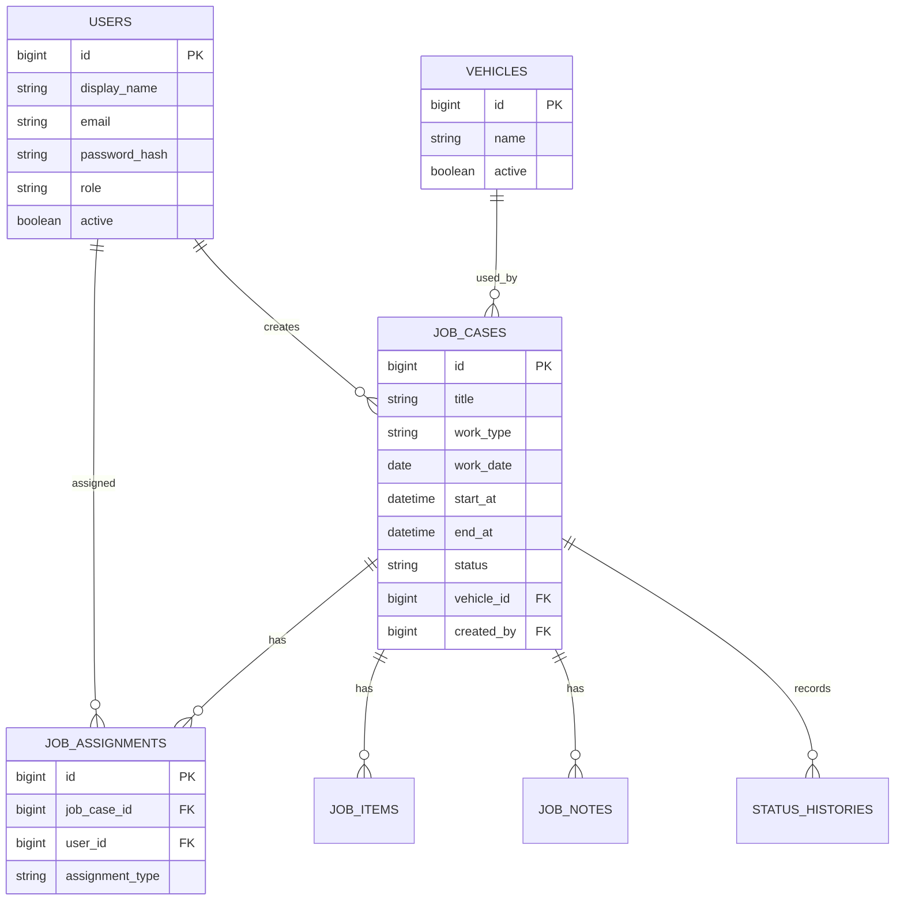

# データベース設計

## 設計方針

MVPでは、案件を中心に、日時、担当者、車両、持参物、ステータスを管理する。Excelの1セルにまとめられていた情報を、検索・更新しやすいデータ構造に分ける。

初期実装ではRDBを前提とし、Java / Spring Bootから扱いやすいテーブル設計にする。DB製品は後続工程で決定するが、開発初期はH2、本番想定はPostgreSQLまたはMySQLを候補とする。

## 概念モデル

## テーブル一覧

| テーブル | 目的 | MVP |
| --- | --- | --- |
| users | ログインユーザーと権限を管理する | 対象 |
| vehicles | 使用車両を管理する | 対象 |
| job_cases | 案件の基本情報と日時を管理する | 対象 |
| job_assignments | 案件と担当者の関連を管理する | 対象 |
| job_items | 持参物、設置物、回収物を管理する | 対象 |
| job_notes | 注意事項や補足メモを管理する | 対象 |
| status_histories | ステータス変更履歴を管理する | 簡易版 |
| audit_logs | 変更履歴を詳細に管理する | 将来拡張 |
| attachments | 写真や資料を管理する | 将来拡張 |

## users

| カラム | 型 | 制約 | 説明 |
| --- | --- | --- | --- |
| id | BIGINT | PK | ユーザーID |
| display_name | VARCHAR(100) | NOT NULL | 画面表示名 |
| email | VARCHAR(255) | NOT NULL, UNIQUE | ログインID |
| password_hash | VARCHAR(255) | NOT NULL | パスワードハッシュ |
| role | VARCHAR(30) | NOT NULL | ADMIN, STAFF, WORKER |
| active | BOOLEAN | NOT NULL | 有効状態 |
| created_at | TIMESTAMP | NOT NULL | 作成日時 |
| updated_at | TIMESTAMP | NOT NULL | 更新日時 |

## vehicles

| カラム | 型 | 制約 | 説明 |
| --- | --- | --- | --- |
| id | BIGINT | PK | 車両ID |
| name | VARCHAR(100) | NOT NULL | 車両表示名 |
| note | VARCHAR(500) | NULL | 備考 |
| active | BOOLEAN | NOT NULL | 利用可能状態 |
| created_at | TIMESTAMP | NOT NULL | 作成日時 |
| updated_at | TIMESTAMP | NOT NULL | 更新日時 |

車両名は実在のナンバーではなく、サンプルでは「車両A」「車両B」のような架空表現にする。

## job_cases

| カラム | 型 | 制約 | 説明 |
| --- | --- | --- | --- |
| id | BIGINT | PK | 案件ID |
| title | VARCHAR(200) | NOT NULL | 案件名 |
| work_type | VARCHAR(50) | NOT NULL | 設置、配送、回収、点検など |
| customer_name | VARCHAR(200) | NOT NULL | 顧客名。サンプルでは架空名のみ使用 |
| location_name | VARCHAR(200) | NULL | 作業場所名 |
| address | VARCHAR(500) | NULL | 作業先住所。サンプルでは架空住所のみ使用 |
| work_date | DATE | NOT NULL | 作業日 |
| start_at | TIMESTAMP | NOT NULL | 開始予定日時 |
| end_at | TIMESTAMP | NOT NULL | 終了予定日時 |
| meeting_time | TIMESTAMP | NULL | 集合予定日時 |
| meeting_place | VARCHAR(300) | NULL | 集合場所 |
| vehicle_id | BIGINT | FK, NULL | 使用車両 |
| status | VARCHAR(30) | NOT NULL | DRAFT, SCHEDULED, CONFIRMED, IN_PROGRESS, DONE, CANCELED |
| created_by | BIGINT | FK | 登録者 |
| updated_by | BIGINT | FK | 最終更新者 |
| created_at | TIMESTAMP | NOT NULL | 作成日時 |
| updated_at | TIMESTAMP | NOT NULL | 更新日時 |

## job_assignments

| カラム | 型 | 制約 | 説明 |
| --- | --- | --- | --- |
| id | BIGINT | PK | 割当ID |
| job_case_id | BIGINT | FK, NOT NULL | 案件ID |
| user_id | BIGINT | FK, NOT NULL | ユーザーID |
| assignment_type | VARCHAR(30) | NOT NULL | MAIN, SUPPORT |
| created_at | TIMESTAMP | NOT NULL | 作成日時 |

同一案件に主担当は1名以上、同行者は0名以上設定できる。

## job_items

| カラム | 型 | 制約 | 説明 |
| --- | --- | --- | --- |
| id | BIGINT | PK | 明細ID |
| job_case_id | BIGINT | FK, NOT NULL | 案件ID |
| item_type | VARCHAR(30) | NOT NULL | BRING, INSTALL, COLLECT |
| name | VARCHAR(200) | NOT NULL | 品目名 |
| quantity | INTEGER | NULL | 数量 |
| note | VARCHAR(500) | NULL | 備考 |
| created_at | TIMESTAMP | NOT NULL | 作成日時 |

## job_notes

| カラム | 型 | 制約 | 説明 |
| --- | --- | --- | --- |
| id | BIGINT | PK | メモID |
| job_case_id | BIGINT | FK, NOT NULL | 案件ID |
| note_type | VARCHAR(30) | NOT NULL | INTERNAL, WORKER, CUSTOMER |
| body | TEXT | NOT NULL | メモ本文 |
| created_by | BIGINT | FK | 作成者 |
| created_at | TIMESTAMP | NOT NULL | 作成日時 |

## status_histories

| カラム | 型 | 制約 | 説明 |
| --- | --- | --- | --- |
| id | BIGINT | PK | 履歴ID |
| job_case_id | BIGINT | FK, NOT NULL | 案件ID |
| from_status | VARCHAR(30) | NULL | 変更前ステータス |
| to_status | VARCHAR(30) | NOT NULL | 変更後ステータス |
| changed_by | BIGINT | FK | 変更者 |
| changed_at | TIMESTAMP | NOT NULL | 変更日時 |
| reason | VARCHAR(500) | NULL | 変更理由 |

## 主な制約

- 案件の終了日時は開始日時より後であること
- 案件には1名以上の主担当を設定すること
- キャンセル済み案件は編集可能だが、完了扱いにはしない
- 車両が無効化されても、過去案件との関連は残すこと
- 削除は物理削除よりも無効化またはステータス変更を優先すること

## 初期サンプルデータ方針

サンプルデータは全て架空情報で作成する。

| 種別 | 例 |
| --- | --- |
| 顧客名 | サンプル株式会社、テスト商事 |
| 担当者名 | 社員A、担当者B |
| 住所 | 東京都サンプル区1-2-3 |
| 車両 | 車両A、車両B |
| 品目 | コーヒーサーバー一式、ウォーターサーバー本体 |

## 今後の検討事項

- 住所を構造化するか、当面は自由入力にするか
- 作業場所と顧客を別テーブル化するタイミング
- 品目マスタを導入するタイミング
- 変更履歴をどの粒度まで残すか
- 通知機能を追加する場合のイベント設計
