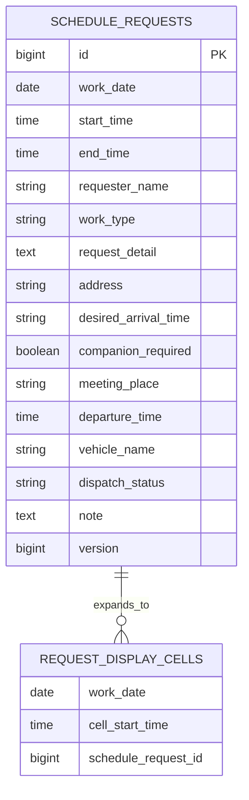

# データベース設計

## 設計方針

MVPでは、ログイン、ユーザー識別、権限管理、案件の業務ステータス管理を行わない。現行Excelに近い軽い運用を優先し、案件情報を1件単位で保存する。通常の水曜日・金曜日は年月から算出する。休み設定と日本の祝日取得はMVP後に追加する。

Excelの1セルにまとめられていた情報を、検索・表示・重複チェックしやすいデータ構造に分ける。DB製品は後続工程で決定するが、開発初期はH2、本番想定はPostgreSQLまたはMySQLを候補とする。

## 概念モデル

補足:

- `REQUEST_DISPLAY_CELLS` は物理テーブルではなく、画面表示時に展開される概念として扱う。
- 実DBでは、案件の `work_date`、`start_time`、`end_time` をもとに30分セルへ展開する。
- 入力済みセルをクリックした場合は、展開されたセルから元の `schedule_requests.id` を特定し、既存案件の入力・編集フォームを開く。

## テーブル一覧

| テーブル | 目的 | MVP |
| --- | --- | --- |
| schedule_requests | 案件の日時と詳細情報を管理する | 対象 |

将来拡張で検討するテーブル:

| テーブル | 目的 |
| --- | --- |
| users | ログインや権限管理を導入する場合に利用者を管理する |
| vehicles | 車両マスタを導入する場合に車両を管理する |
| audit_logs | 変更履歴を詳細に管理する |
| attachments | 写真や資料を管理する |
| notifications | 通知履歴を管理する |
| schedule_day_offs | 個人的に出勤できない水曜・金曜の休みを管理する |
| calendar_holidays | 外部カレンダーから取得した日本の祝日をキャッシュする |

## schedule_requests

| カラム | 型 | 制約 | 説明 |
| --- | --- | --- | --- |
| id | BIGINT | PK | 案件ID |
| work_date | DATE | NOT NULL | 作業日。新規入力時はクリックした空白セルの日付 |
| start_time | TIME | NULL | 開始時間 |
| end_time | TIME | NULL | 終了時間 |
| requester_name | VARCHAR(100) | NULL | 依頼者名。MVPでは自由入力 |
| work_type | VARCHAR(30) | NULL | INSTALL, COLLECT, EXCHANGE, DELIVERY, RECEIVING, PRODUCT_MANAGEMENT |
| request_detail | TEXT | NULL | 依頼内容。機種、台数、内容物などをまとめて記入する |
| address | VARCHAR(500) | NULL | 現場住所。サンプルでは架空住所のみ使用 |
| desired_arrival_time | VARCHAR(100) | NULL | 現場到着希望時間。`10:00`、`午前中`、`13時頃`、`時間指定なし` などを自由入力 |
| companion_required | BOOLEAN | NOT NULL, DEFAULT FALSE | 同行ありチェック |
| meeting_place | VARCHAR(300) | NULL | 同行ありの場合の集合場所 |
| departure_time | TIME | NULL | 同行ありの場合の出発時間 |
| vehicle_name | VARCHAR(100) | NULL | 同行ありの場合の使用車両 |
| dispatch_status | VARCHAR(30) | NOT NULL, DEFAULT `UNANSWERED` | UNANSWERED, REQUIRED, DISPATCHED |
| note | TEXT | NULL | 備考。受付、搬入口、現地担当者への連絡、注意事項などをまとめる |
| version | BIGINT | NOT NULL, DEFAULT 0 | 同一案件の同時更新を検知する楽観ロック用バージョン |
| created_at | TIMESTAMP | NOT NULL | 作成日時 |
| updated_at | TIMESTAMP | NOT NULL | 更新日時 |

補足:

- 入庫、商品管理も `schedule_requests` に保存し、定例データとして自動生成しない。
- 入庫、商品管理でも `requester_name`、`start_time`、`end_time` を入力し、通常案件と同じ一覧反映条件と重複チェックを適用する。
- 入庫、商品管理では `requester_name`、`start_time`、`end_time`、`work_type` だけを必須とし、その他のNULLを未入力警告の対象にしない。
- `companion_required` をFALSEへ変更した場合は、`meeting_place`、`departure_time`、`vehicle_name` をNULLへ戻す。
- 過去案件はMVPでは自動削除せず、無期限に保持する。

## 下書きの扱い

- 最初の入力値を保存した時点で `schedule_requests` を作成する。入力がないままフォームを離れた場合はレコードを作成しない。
- 文字入力項目は前後の空白を除去し、空文字だけの場合はNULLへ正規化する。
- `requester_name`、`start_time`、`end_time` のいずれかがNULLのレコードを下書きとして扱う。
- 下書き専用の業務ステータス列は持たず、3項目の充足状況から判定する。
- 下書き一覧は `work_date`、入力済みの `requester_name`、`updated_at` を表示する。
- 下書き一覧は全月を対象とし、`updated_at` の降順で取得する。
- 下書きは時間枠を確保しない。3項目がそろう保存処理で重複を再確認する。
- 重複時はレコードを下書きのまま保持し、入力値を失わない。
- 利用者が下書き削除を確認した場合は物理削除する。
- 過去月の下書きは再開を拒否するが、不要データ整理のため物理削除を許可する。

## 同時登録方針

- 重複確認と保存を一体の処理として行い、同じ時間帯では先にコミットした案件を採用する。
- 後続処理は保存せず、競合した日付と時間帯を含むエラーを返す。
- 同一案件の同時編集は `version` により検知し、古い画面からの上書きを拒否する。
- 同一案件の同時編集を拒否した場合も、利用者が入力した画面上の値は保持し、最新情報の再読込を促す。
- 具体的なトランザクション分離レベルとロック方式は、採用DBを決定する技術設計時に確定する。

## インデックス・制約初期案

- 月間一覧取得と重複確認のため、`schedule_requests(work_date, start_time, end_time)` に複合インデックスを設定する。
- `dispatch_status` は `UNANSWERED`、`REQUIRED`、`DISPATCHED` だけを許可する。
- 時刻範囲、30分単位、作業種別、同行条件はService層で検証し、採用DBで無理なく表現できる制約はDBにも追加する。
- `created_at`、`updated_at`、`version` はアプリケーションから一貫して更新する。

## MVP後: schedule_day_offs

対象月の水曜日・金曜日はレコードなしでも通常日として表示する。個人的に出勤できない日のみ、休みレコードを保存する。

| カラム | 型 | 制約 | 説明 |
| --- | --- | --- | --- |
| work_date | DATE | PK | 対象日 |
| created_at | TIMESTAMP | NOT NULL | 作成日時 |
| updated_at | TIMESTAMP | NOT NULL | 更新日時 |

- 休みの日は日付列を残し、先頭セルに `休み`、全時間セルに休み専用色を表示する。案件の新規入力と保存を禁止する。
- 休みを解除する場合は例外レコードを削除し、通常の勤務予定日に戻す。
- 休み設定前に対象日の `schedule_requests` 件数を取得し、確認画面へ削除件数として表示する。
- 利用者の確認後、同一トランザクション内で対象日の `schedule_requests` をすべて物理削除してから休みレコードを保存する。
- 全案件削除と休みレコード保存の一方が失敗した場合は、処理全体をロールバックする。
- 削除された案件の復元用レコードや履歴を保持するかは、休み設定の実装前に再確認する。

## MVP後: calendar_holidays

外部の日本祝日カレンダーから取得した祝日を保存する。月間一覧を開くたびに外部サービスへ問い合わせるのではなく、キャッシュした値を一覧生成と入力検証に利用する。

| カラム | 型 | 制約 | 説明 |
| --- | --- | --- | --- |
| holiday_date | DATE | PK | 祝日の日付 |
| holiday_name | VARCHAR(100) | NOT NULL | 祝日名 |
| source | VARCHAR(100) | NOT NULL | 取得元の識別子 |
| synced_at | TIMESTAMP | NOT NULL | 最終取得日時 |

- 月間一覧は対象月の水曜日・金曜日から `calendar_holidays` に存在する日を除外して生成する。
- 祝日は案件の新規登録、更新、コピー先指定、休み設定の対象にできない。
- 祝日には案件が入らない運用を前提とし、祝日と判定した日付列を一覧生成時に除外する。
- 祝日同期を理由に `schedule_requests` を自動削除しない。
- 外部カレンダーの取得に失敗した場合は、DBに保存済みの前回取得データをそのまま使用する。
- 取得に失敗し、保存済みデータもない場合は、祝日除外を行わず水曜日・金曜日を通常表示する。外部サービスの障害だけを理由に一覧表示や案件入力を停止しない。
- 外部カレンダーの具体的な取得元と同期頻度は、実装設計時に確定する。

## MVP後: 案件コピー方針

- コピーは既存レコードの更新ではなく、新しい `schedule_requests.id` を持つ新規案件として扱う。
- `work_date` はコピー先として選択した日付を使う。
- `id`、`work_date`、`created_at`、`updated_at` を除くフォーム入力値をコピーする。
- コピー元の案件レコードは変更、削除しない。
- コピーした開始時間・終了時間がコピー先の既存案件と重なる場合、新規レコードを保存しない。
- 重複時もコピー値は画面上に残し、開始時間・終了時間を修正できるようにする。

## 過去月の変更制限

- アプリケーションが日本時間 `Asia/Tokyo` で取得した現在日付を基準に、`work_date` の年月が現在年月より前の場合は過去月として扱う。
- 過去月の一覧と案件詳細は取得できるが、新規作成、更新、物理削除を拒否する。
- 画面上の無効化だけに依存せず、Service層でも過去月への変更を検証する。
- 現在月内の経過日は編集可能とする。
- データルール上は未来月の登録上限を設けない。ただし、初期MVPの画面から移動できる未来月は翌月までとする。
- MVPでは、未来日でも水曜日・金曜日であることを検証する。休み・祝日の検証は各機能の追加時に実装する。

## 一覧反映条件

スケジュール一覧へ案件を表示する条件:

- `requester_name` が入力されている
- `start_time` が入力されている
- `end_time` が入力されている

この3項目のいずれかが未入力の場合、スケジュール一覧には表示しない。

## 必須チェック

全作業種別で必須:

- 依頼者名
- 開始時間
- 終了時間
- 作業種別

設置、回収、交換、配達で必須:

- 依頼内容
- 現場住所
- 現場到着希望時間

補足:

- 現場到着希望時間は開始時間・終了時間とは異なり、厳密な時刻型にはしない。
- 顧客との約束が `午前中`、`13時頃`、`なるべく早め` のような表現になることがあるため、自由入力の文字列として扱う。

設置、回収、交換、配達で条件付き必須:

- 同行ありチェックを付けた場合、集合場所を必須にする
- 同行ありチェックを付けた場合、出発時間を必須にする
- 同行ありチェックを付けた場合、使用車両を必須にする
- 同行ありチェックが付いていない場合、集合場所、出発時間、使用車両は未設定として扱う

入庫、商品管理では、上記の通常作業向け必須項目と条件付き必須項目がNULLでも、`＊未入力` やフォーム上部の不足警告を表示しない。

## 時間範囲の制約

- 終了時間は開始時間より後であること
- 時間は30分単位で扱う
- スケジュール表の表示時間帯は8:30-17:30固定とする
- 開始時間・終了時間は8:30-17:30内のみ許可する
- 同じ作業日の既存案件と時間範囲が重なる場合、入力を無効にする
- 必須詳細項目が未入力で `＊未入力` 表示になっている案件も、重複チェック上は通常の案件として扱う
- 重複時は `その時間はすでに埋まっています` のような注意表示を出す

重複例:

| 既存案件 | 新規入力 | 判定 |
| --- | --- | --- |
| 9:00-11:00 | 10:00-12:00 | 重複 |
| 9:00-11:00 | 11:00-12:00 | 重複なし |
| 13:00-14:00 | 12:00-13:00 | 重複なし |

## キャンセル方針

MVPではキャンセル済みステータスを持たない。

依頼キャンセル時は案件レコードを物理削除する。削除後は、該当時間帯のセルを未入力扱いに戻す。

変更履歴や復元が必要になった場合は、将来拡張でキャンセル履歴や監査ログを検討する。

## 初期サンプルデータ方針

サンプルデータは全て架空情報で作成する。

ポートフォリオで画面の動きを説明しやすくするため、1日あたり3件程度の案件を基本にし、設置、回収、交換、配達、入庫、商品管理の作業種別を一通り含める。

現場住所は、名古屋市、豊田市、岡崎市、一宮市など愛知県内の市に限定する。ただし、番地、建物名、顧客名、担当者名は実在情報を使わず、架空表現にする。

| 種別 | 例 |
| --- | --- |
| 依頼者名 | 社員A、社員B |
| 住所 | 愛知県名古屋市サンプル区1-2-3、愛知県豊田市サンプル町4-5 |
| 車両 | 車両A、車両B |
| 依頼内容 | コーヒーサーバー一式の設置、ウォーターサーバー本体の回収、既存機器の交換、備品の配達 |

## 今後の検討事項

- 外部祝日カレンダーの取得元と同期頻度
- 車両を自由入力にするか、将来的にマスタ化するか
- 依頼者名を将来的にログインや社員マスタと紐づけるか
- ログインや変更履歴をどのタイミングで導入するか
