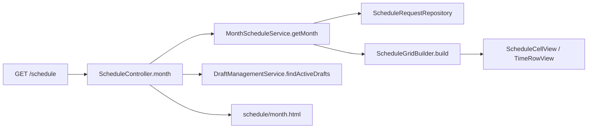
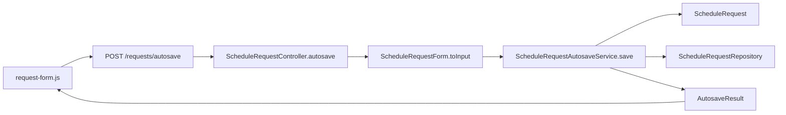

# Javaコード読解ガイド

## 1. このガイドの目的

このガイドは、JavaとSpring Bootを学び始めた開発者が、画面操作を起点にしてController、Service、Entity、Repository、DBまで処理を追うための案内図である。

最初から全クラスを読む必要はない。まず1つの画面操作について、次の順で役割を確認する。

1. ControllerでURLと受け取る値を確認する
2. Controllerが呼ぶServiceを確認する
3. Serviceが使う業務ルールとEntityを確認する
4. RepositoryでDBの検索・保存箇所を確認する
5. 対応テストで具体例を確認する

## 2. 最初の30分で読むクラス

最初は案件の自動保存経路に絞り、次の順で読む。

1. `ScheduleRequestController`
   - `autosave()`が自動保存APIの入口である
   - FormをJavaの入力値へ変換し、Serviceを呼ぶ
2. `ScheduleRequestForm`
   - HTMLフォームから受け取る項目を保持する
   - `toInput()`で業務処理用の`ScheduleRequestInput`へ変換する
3. `ScheduleRequestAutosaveService`
   - `save()`が保存処理全体の入口である
   - `saveInTransaction()`が新規・更新・重複判定・公開を調整する
4. `ScheduleRequest`
   - 案件データと業務ルールを持つEntityである
   - `draft()`、`applyInput()`、`canAppearOnSchedule()`、`publish()`を順に確認する
5. `ScheduleRequestRepository`
   - DBへの保存と時間重複検索を担当する
6. `ScheduleRequestAutosaveServiceTest`
   - 下書き、公開、競合、古いversionの具体例を確認できる

この経路を理解すると、Controller、Service、Entity、Repositoryという基本的な役割分担を一度に確認できる。

JavaScriptが使えない場合の通常送信は`ScheduleRequestController.save()`から始まる。入口と戻り値は異なるが、保存処理は同じ`ScheduleRequestAutosaveService.save()`へ合流する。

## 3. パッケージの役割

| パッケージ | 主な役割 | 最初に読むクラス |
| --- | --- | --- |
| `schedule` | 月間一覧、セル生成、日付規則、休み | `ScheduleController` |
| `request` | 案件入力、自動保存、コピー、削除、固定予定 | `ScheduleRequestController` |
| `holiday` | 祝日CSV取得と祝日キャッシュ | `HolidaySyncService` |
| `retention` | 保存期限を過ぎたデータの削除 | `ScheduleDataRetentionConfiguration` |
| `config` | 時刻、デモデータ、共通パスワードゲート、CSRF | `SecurityConfiguration` |

`record`で終わるViewやResultは、処理そのものではなく、層の間で渡すデータを表す。最初はControllerとServiceを先に読み、必要になった時点で対応するrecordを確認する。

## 4. 月間スケジュールを表示する流れ

読む順番:

1. `ScheduleController.month()`
   - URLの年月を解決する
   - 月間表示と有効な下書きをModelへ渡す
2. `MonthScheduleService.getMonth()`
   - 対象月、水曜・金曜、祝日、休み、公開案件を集める
   - 月タブ、日付見出し、セル行を`MonthScheduleView`へまとめる
3. `ScheduleGridBuilder.build()`
   - 8:30〜17:30の30分行を作る
   - 空き、案件、休みのセルを作る
   - 案件色と継続セルの矢印を決める
4. `ScheduleCellView`
   - `available()`、`occupied()`、`dayOff()`が3種類のセルを表す

`ScheduleController.month()`は表示データの取得だけを行い、DBを更新しない。固定予定作成と期限切れ下書き削除は`ScheduleMaintenance`が担当する。

具体例は`MonthScheduleVerticalSliceTest`と`MonthScheduleServiceTest`で確認する。

## 5. 入力内容を自動保存する流れ

`ScheduleRequestAutosaveService.save()`では、次の順に確認する。

1. `ScheduleDatePolicy.requireRegistrable()`で登録可能日を確認する
2. `saveInTransaction()`で新規Entityを作るか既存Entityを取得する
3. versionが古ければ`STALE`として現在の内容を返す
4. 一覧へ出せる入力なら`findConflict()`で時間重複を確認する
5. 重複時は理由付き下書き、重複なしなら公開状態にする
6. PostgreSQL排他制約が同時登録を検出した場合は、別トランザクションで競合下書きを残す
7. `AutosaveResult`をJSONとして画面へ返す

状態を読む際は、次の3つを区別する。

- `EntryState.DRAFT`: 一覧には出ない下書き
- `EntryState.PUBLISHED`: 月間一覧へ出る案件
- `DraftReason`: 入力不足か時間重複かを示す下書き理由

PostgreSQL固有の同時登録は`PostgreSqlConcurrencyTest`、画面を含む流れは`RequestWorkflowVerticalSliceTest`と`ScheduleBrowserE2ETest`で確認する。

## 6. コピー、削除、休みの流れ

### 案件コピー

1. `RequestCopyController`
2. `RequestCopyService`
3. `ScheduleRequestInput.forCopy()`
4. `ScheduleDatePolicy`
5. `ScheduleRequestRepository`

コピー元の確認、コピー先日付の確認、時間重複確認、保存の順に進む。具体例は`RequestCopyVerticalSliceTest`にある。

### 案件キャンセル

1. `ScheduleRequestController.confirmCancellation()`と`cancel()`
2. `RequestDeletionService`
3. `RecurringFixedRequestService.recordSkipIfFixed()`
4. `ScheduleRequestRepository`

固定予定を利用者が削除した場合は、同じ予定を自動作成し直さないためのskipを記録してから案件を削除する。

### 休み設定

1. `ScheduleDayOffController`
2. `DayOffService`
3. `ScheduleDatePolicy`と`HolidayCalendarService`
4. `ScheduleDayOffRepository`と`ScheduleRequestRepository`

休みにする日は、その日の案件と下書きを削除して休みレコードを保存する。具体例は`DayOffVerticalSliceTest`にある。

## 7. 起動時に動く処理

画面操作なしで動く処理は、通常のController経路と分けて読む。

### スケジュール保守

1. `ScheduleMaintenance`
2. `HolidaySyncService`
3. `CabinetOfficeHolidayClient`
4. `RecurringFixedRequestService`
5. `DraftManagementService`

起動時と、アプリ稼働中の毎日3時（日本時間）に、祝日同期、固定予定作成、期限切れ下書き削除を順番に実行する。外部CSVの取得に失敗した場合は保存済みキャッシュを使用し、キャッシュもない場合は固定予定作成を見送る。停止中に3時を過ぎた場合は、次回起動時に同じ処理を行う。

### 保存期限切れデータの削除

1. `ScheduleDataRetentionConfiguration`
2. `ScheduleDataRetentionService`
3. 対応Repository

cloud profileで有効になり、起動時に保持期限を過ぎた案件、下書き、休みを削除する。

## 8. Spring Bootでつまずきやすい点

### アノテーション

- `@Controller`: HTTPリクエストを受け、画面名またはJSONを返す
- `@Service`: 業務処理をまとめる
- `@Repository`相当のinterface: Spring Data JPAがDB操作を実装する
- `@Transactional`: 複数のDB操作を1つの処理単位にする
- `@Configuration`: 起動時に必要な部品や処理を登録する

### コンストラクタインジェクション

ControllerやServiceのコンストラクタ引数は、そのクラスが仕事をするために必要な協力先である。処理を追うときは、フィールド一覧よりも、実際のメソッド内でどの協力先を呼んでいるかを見る。

### URLからメソッドを探す

SpringはControllerをフレームワークから呼ぶため、Javaコード内に直接の呼び出し元が見つからない。`@RequestMapping`と`@GetMapping`または`@PostMapping`を組み合わせて、URLに対応する入口を判断する。

### JPA EntityとRepository

`ScheduleRequest`などのEntityはDBの行を表すだけでなく、状態遷移や入力正規化も担当する。Repositoryの`saveAndFlush()`でSQLが即時実行され、PostgreSQLの排他制約違反などをその場で検出できる。

Repositoryの長いメソッド名には実装クラスがない。Spring Data JPAが`findBy...`や`deleteBy...`という名前から検索・削除処理を生成する。`@Query`が付いたメソッドは、直下のJPQLが実際の検索条件である。

### トランザクションとversion

`@Transactional`は、途中で失敗したDB更新をまとめて戻す境界である。`ScheduleRequestAutosaveService`の`TransactionTemplate`は、PostgreSQLが同時登録を拒否した後に、別トランザクションで競合下書きを保存するために使う。

`ScheduleRequest.version`は画面を開いた後に別の利用者が更新していないかを判定する値である。IDが同じでもversionが古ければ、入力内容で最新データを上書きしない。

### Clock

`LocalDate.now()`を直接呼ばず、注入された`Clock`を使うことで、日本時間の現在日をテストで固定できる。日付判定のテストが実行日によって変わらない理由はここにある。

### `record`とFormとEntity

- `ScheduleRequestForm`: HTMLの入力値を受け取る可変オブジェクト
- `ScheduleRequestInput`: Serviceへ渡す変更不可の入力値
- `ScheduleRequest`: DBへ保存され、状態遷移も担当するEntity
- `AutosaveResult`や各種View: ControllerからJavaScriptやThymeleafへ返す値

似た項目が並んでいても役割が異なる。入力を追うときは`Form -> Input -> Entity`、表示を追うときは`Entity -> View/Result -> HTMLまたはJSON`の向きで読む。

## 9. テストを仕様書として読む

次の順で読むと、細部へ入りすぎずに仕様を把握できる。

1. `RequestWorkflowVerticalSliceTest`: 案件入力、編集、下書き、キャンセル
2. `MonthScheduleVerticalSliceTest`: 月間一覧、色、祝日
3. `RequestCopyVerticalSliceTest`: コピー
4. `DayOffVerticalSliceTest`: 休み
5. `ScheduleRequestAutosaveServiceTest`: 保存状態の細かい分岐
6. `ScheduleRequestTest`: Entityの入力正規化と必須判定
7. `PostgreSqlConcurrencyTest`: PostgreSQLの同時登録と排他制約
8. `ScheduleMaintenanceTest`: 祝日同期、固定予定、期限切れ下書きの実行順序
9. `SecurityConfigurationTest`と`SecurityConfigurationAccessGateTest`: CSRFと共通パスワードゲート
10. `ScheduleBrowserE2ETest`と`ScheduleBrowserRecoveryE2ETest`: JavaScriptを含む利用者操作

テスト本文は、準備、操作、期待結果の空行で区切られている。まずテスト名と期待結果を読み、必要な場合だけ準備処理へ戻る。

## 10. 主要画面の手動確認項目

リファクタリング後の画面確認では、次の代表操作を1回ずつ確認すればよい。今回の最終検証では同じ経路をPlaywright E2Eで確認しているため、画面に違和感がある場合やRender反映後の確認時に使用する。

1. 月間スケジュールを開き、月移動、案件セル、休み、祝日、固定予定の表示を確認する
2. 空きセルから入力フォームを開き、入力内容が自動保存されて月間表示へ反映されることを確認する
3. 入力途中の案件が下書き一覧へ表示され、再編集できることを確認する
4. 案件を別の日へコピーし、元案件とコピー先案件が両方残ることを確認する
5. 案件をキャンセルし、月間表示から消えることを確認する
6. 休みを設定して対象日の案件が削除され、休みを解除すると空きセルへ戻ることを確認する
7. PC幅とiPhone幅で、主要ボタン、入力欄、月間表の操作に重なりや見切れがないことを確認する

## 11. 読解時に後回しにしてよいもの

最初の読解では、次を後回しにしてよい。

- Thymeleafテンプレートの細かな属性
- Flyway SQLの制約定義
- 共通パスワードゲートのSpring Security設定
- Render、Neon、バックアップスクリプト
- Playwrightのブラウザ操作API

主要な業務フローを理解した後に、興味のある技術領域として個別に読む。
