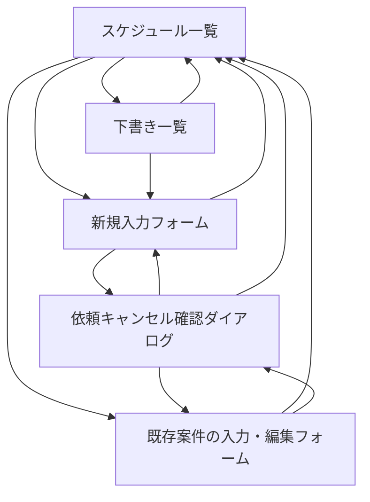

# 画面一覧

## 画面設計方針

現行Excelの利点である「日付と時間帯を見れば全体感が分かる」特徴を残しつつ、各案件の詳細情報を1件単位で確認できる画面構成にする。フェーズ5Fでは機能と情報量を変えず、Excelを模倣した外観から、視覚階層を整理した洗練されたモノトーン基調のデザインへ全画面を刷新する。

ログイン、ユーザー管理、権限管理は導入せず、社員も配送・設置担当者も、掲示板のように同じ画面を同じ権限で参照・編集する。

## MVP画面一覧

初期MVPではS-001からS-004を対象に、最小限の項目入力、自動保存、下書き管理、一覧反映、重複防止、二重確認付きの依頼キャンセルまで実際に動作させる。フェーズ5Bから5Eで追加機能を完成させ、フェーズ5Fで既存画面と追加画面をまとめて全面的にデザイン改修する。

| ID | 画面名 | 主な利用者 | 目的 |
| --- | --- | --- | --- |
| S-001 | 月間スケジュール一覧画面 | 全利用者 | 現在月を起点に、日付・30分単位の予定をExcelに近い表で確認する |
| S-002 | 案件入力・編集フォーム | 全利用者 | 案件の詳細情報を入力・編集する |
| S-003 | 下書き一覧 | 全利用者 | 未完成または時間重複で未反映の入力を理由付きで確認し、入力再開または削除する |
| S-004 | 依頼キャンセル確認ダイアログ | 全利用者 | 押し間違いを防ぎながら依頼をキャンセルする |

## 画面詳細

### S-001 月間スケジュール一覧画面

| 項目 | 内容 |
| --- | --- |
| 目的 | 現在月を起点に、日付・30分単位で案件の埋まり具合を確認する |
| 表示項目 | 対象年月、月タブ、下書き件数、日付、時間帯、先頭セルの依頼者名・作業種別・＊未入力表示、2セル目以降の矢印、案件単位の色 |
| 主な操作 | 月切り替え、下書き一覧表示、空白セルクリックによる新規入力、入力済みセルクリックによる既存案件の確認・編集 |
| MVP | 最重要 |

補足:

- 現行Excelに近い表形式を採用する
- サイトを開いた時点の日本時間から現在年月を取得し、その月を自動表示する
- 現在月の表が画面幅を超える場合は、今日または今日以降で最初の勤務日が見える位置へ初期スクロールする
- 前月・翌月を選択した場合は、日付列の先頭から表示する
- 対象月に含まれるすべての水曜日・金曜日を日付列として自動表示する
- 日付列は月内の日付が早い順に左から並べる
- 月タブは、サイト表示時点の現在月を基準に前月・当月・翌月の3か月分を表示する
- 日本時間の今日より前の日付は閲覧専用とし、空白セルをクリックしても新規入力フォームへ遷移しない
- 前月・当月・翌月以外の月を参照する年月選択、祝日除外、休み設定は初期MVP完成後に追加する
- たとえば6月28日に開いた場合は6月版を表示し、7月予定を入れたい場合は月タブから7月版へ移動する
- 1セルは30分単位とする
- 表示時間帯は8:30-17:30固定とし、1日あたり18セルを表示する
- 1セルに入る案件は1件のみとする
- 同じ案件が複数セルにまたがる場合、同じ色で表示する
- 複数セルにまたがる案件では、先頭セルに依頼者名と、入力されている場合だけ作業種別を表示し、2セル目以降には矢印を表示する。入庫、商品管理で依頼者名が空の場合は作業種別だけを表示する
- 依頼者名、開始時間、終了時間がそろっているが、他の必須項目が不足している場合は、先頭セルの依頼者名の下あたりに `＊未入力` と表示する
- 作業種別はセル内に表示するが、依頼内容、会社名、機械名、住所などは表示せず、案件入力・編集フォームで確認する
- 作業種別によってフォーム項目は切り替えず、細かい違いは依頼内容にまとめて入力する
- 色は5色の固定パレットから、同じ日の開始時間が早い案件順に自動割り当てする
- キャンセルや時間変更後はその日の色を再計算し、6件以上では前後の案件に同じ色が連続しないよう5色を再利用する
- 利用者が色を選ぶ機能はMVPでは用意しない
- 空白セルをクリックした場合は、その日付の新規入力フォームへ遷移する
- 空白セルから開いた新規入力フォームでは、クリックした時間帯で入力時間を固定しない
- 入力済みセルをクリックした場合は、そのセルに対応する既存案件の入力・編集フォームへ遷移する
- 同じ案件が複数セルにまたがる場合、どのセルをクリックしても同じ案件の入力・編集フォームへ遷移する
- その日の全セルが埋まっている場合、新規入力フォームへ移動できる空白セルは存在しない
- 依頼者名と時間範囲がそろい、重複がなければ一覧へ反映する。作業種別が未入力でも、それだけを理由に先頭セルへ `＊未入力` を表示しない
- 入庫、商品管理は依頼者名を任意とし、時間範囲と作業種別がそろい、重複がなければ一覧へ反映する
- 開始時間と終了時間は8:30-17:30の30分単位から選択する
- 同じ日の既存案件と時間範囲が重なる場合は反映しない
- 同時登録では先にコミットした案件だけを `PUBLISHED` とし、後続を理由付き `DRAFT` として競合時間帯を表示する
- 既存案件が12:00-14:00の場合、14:00開始の案件は隣接として登録できる

### S-002 案件入力・編集フォーム

| 項目 | 内容 |
| --- | --- |
| 目的 | Excelセルに収まらない案件詳細を入力・確認する |
| 全作業種別の必須項目 | 開始時間、終了時間、作業種別 |
| 通常作業の必須項目 | 設置、回収、交換、配達の場合のみ、依頼者名、依頼内容、顧客先到着希望時間 |
| 条件付き必須 | 同行なしの場合は現場住所もしくは会社名。同行ありの場合は集合場所、出発時間 |
| 任意項目 | 入庫・商品管理の依頼者名、使用車両の指定、出庫状態、備考 |
| 主な操作 | 入力、編集、前のページに戻る、依頼キャンセル |
| MVP | 最重要 |

補足:

- 日付はスケジュール一覧で選択した日付を使う
- 日本時間の今日より前の案件フォームは閲覧専用とし、入力、編集、キャンセル、コピーを操作できない
- 閲覧専用画面では自動保存の案内を表示せず、`閲覧専用` と表示する
- 開始時間・終了時間は8:30-17:30内のみ入力できる
- 作業種別は、設置、回収、交換、配達、入庫、商品管理から選択する
- 入庫、商品管理は通常の入力フォームから手動登録し、依頼者名は任意とする
- 入庫、商品管理では開始時間、終了時間、作業種別以外を任意入力とし、空欄でも `＊未入力` や不足警告を表示しない
- 顧客先到着希望時間は自由入力とし、`10:00`、`午前中`、`午後かつ17時まで`、`時間指定なし` などを入力できる
- 同行ありチェックを付けた場合のみ、集合場所、出発時間、使用車両の3つの入力欄を動的に表示する
- 同行ありチェックは依頼者名と依頼内容の間に表示する
- 同行ありチェックを付けた場合、現場住所もしくは会社名は任意入力へ切り替える
- 同行ありチェックが付いていない場合、3つの入力欄はフォーム上に表示しない
- 同行ありチェックを外した場合、集合場所、出発時間、使用車両の保存値を削除する
- 集合場所と出発時間には赤字の `＊必須` を表示し、使用車両の指定には `指定がなければ空欄` のプレースホルダーを表示する
- 出庫状態は `未回答`、`出庫が必要`、`出庫済み` の3状態とし、初期値は `未回答` とする
- 確定ボタンは置かない
- 明示的な確定ステータスは持たない
- 入力内容は入力欄から離れたタイミングで自動保存する
- 前のページに戻る操作をした場合も未保存内容を保存する
- フォーム上部に `2026年6月19日（金）の案件入力` または `2026年6月19日（金）の案件確認・編集` のように対象日を明記する
- 最初の入力値を保存した時点で内部状態を `DRAFT` とし、未入力のまま離れた場合は空レコードを作らない
- 一覧反映条件がそろった時点で重複を再確認し、空いていれば `PUBLISHED` として一覧へ反映する
- 重複時は入力値を `DRAFT` として残し、競合した時間帯を含むエラーを表示する
- 必須項目は項目名の先頭付近へ赤字で `＊必須` を表示する
- 未入力や入力エラーはフォーム上部と該当項目付近に赤字で表示する
- 自動保存中は `保存中...`、成功時は `保存済み`、失敗時は `保存できませんでした` をフォーム上部へ表示する
- 保存失敗時は画面上の入力値を保持し、赤字のエラーと `再試行` を表示する
- ブラウザを閉じる、再読み込みするなどの未保存離脱警告はMVPでは設けない
- 通常作業から入庫・商品管理へ変更し、詳細が入力済みの場合は、削除内容の確認後に新しい作業種別、依頼者名、時間範囲以外の詳細を削除する
- 備考欄の上には `例: 現地担当者への連絡、注意事項等あれば` のような補助テキストを表示する
- 時間重複時は `PUBLISHED` へ変更せず、`DRAFT` として入力値を保持して注意表示を出す
- 既存案件の時間変更が重複した場合は元の時間枠を維持し、変更中の値を画面に残して赤字エラーを表示する
- 開始時間と終了時間の変更途中で一時的に不正な範囲になった場合は保存せず、両方が正常になった時点でまとめて保存する
- 公開済み案件の一覧反映項目を編集中に一時的に消した場合は変更を保存せず、元の公開済み案件と時間枠を維持する。画面上の値を残して不足を表示し、有効な入力がそろった時点で更新する
- `DRAFT` ではボタン名を `下書きを削除`、`PUBLISHED` では `依頼をキャンセル` とする

## 端末対応

- PCでの入力を主対象とする
- iPhoneではスケジュール一覧と案件詳細を正常に閲覧できることをMVPの合格条件とする
- iPhoneでの新規入力、編集、キャンセルの操作性はMVPの合格条件に含めない
- 月間スケジュール表は横幅が広くなるため、iPhoneではスクロール、拡大を前提にする
- iPhone専用の簡易表示はMVPでは作らない

### S-003 下書き一覧

| 項目 | 内容 |
| --- | --- |
| 目的 | 一覧へ未反映の入力を見失わず、再開または削除できるようにする |
| 表示項目 | 下書き件数、作業日、入力済みの依頼者名、最終更新日時、下書き理由、時間重複時の競合時間帯 |
| 主な操作 | 入力を再開、下書きを削除、一覧へ戻る |
| MVP | 対象 |

補足:

- 月間一覧上部の `下書き一覧（件数）` から開く
- 表示月にかかわらず、作業日が当日以降である全月の下書きを最終更新日時の新しい順に表示する
- 依頼者名が未入力の場合は、作業日と `依頼者名未入力` を表示する
- 下書き理由は `入力不足` または `時間重複` とし、時間重複では `時間が重複したため未反映（12:00-14:00）` のように表示する
- 下書きは時間枠を確保しない
- 下書き削除は確認後に物理削除する
- 下書き一覧の取得前に、日本時間で作業日を過ぎた下書きを自動で物理削除する
- 自動削除された下書きは一覧に表示せず、復元機能も設けない
- 一覧反映条件がそろい、重複がなく `PUBLISHED` になった時点で下書き一覧から除外する

### S-004 依頼キャンセル確認ダイアログ

| 項目 | 内容 |
| --- | --- |
| 目的 | 誤操作による依頼キャンセルを防ぐ |
| 表示項目 | キャンセル対象の日付、時間範囲、依頼者名、作業種別 |
| 主な操作 | キャンセル実行、戻る |
| MVP | 対象 |

補足:

- キャンセル済みステータスは持たない
- キャンセル後は案件データを物理削除し、該当セルを未入力扱いに戻す
- `PUBLISHED` の案件だけを対象とし、日付、時間範囲、依頼者名、作業種別を表示して二重確認する
- `DRAFT` の削除は下書き一覧またはフォームから確認1回で実行する
- 別画面ですでに削除された案件を編集しようとした場合は、`案件は削除されています` と赤字表示する
- キャンセル履歴を残すかどうかは将来拡張で検討する

## 初期MVP後の追加画面

| ID | 画面名 | 内容 |
| --- | --- | --- |
| F-001 | 変更履歴画面 | 案件ごとの変更履歴を確認する |
| F-002 | 通知設定画面 | 試運転で見落としが発生し、通知が必要と判断した場合に通知先や通知方法を設定する |
| F-003 | 地図・ルート画面 | 作業場所と移動順を地図で確認する |
| F-004 | CSV出力画面 | 案件一覧を外部出力する |
| F-005 | 作業完了報告画面 | 完了メモや写真を登録する |
| F-006 | ダッシュボード画面 | 日別件数、未入力セル、時間帯の埋まり具合を可視化する |
| F-007 | コピー先選択画面 | 日付入力または簡易スケジュール表から案件のコピー先を選ぶ |
| F-008 | 休み設定確認ダイアログ | 対象日の案件を確認して休み表示へ置き換える |
| F-009 | AIアシスタント | 架空データで使い方への回答と確認付きの案件入力支援を試作する。実運用ではローカルAIを優先し、会社承認なしに実データを外部送信しない |

F-007とF-008、任意年月選択、祝日列の自動除外はフェーズ5で追加する。その他の画面は必要性を確認して将来拡張とする。フェーズ5Fの全面UIリニューアルは新しい業務機能や画面を追加する工程ではなく、S-001からS-004、F-007、F-008を共通のデザイン規則で再構成する工程とする。

フェーズ5追加画面の受入条件:

- 任意年月選択は年の数値入力と月の選択を使用し、表示中の年月にかかわらず下部3タブは現在月基準の前月・当月・翌月を表示する
- 祝日列は一覧から除外し、祝日への新規入力・編集画面へは遷移しない
- F-007はコピー元の月を初期表示し、直接日付入力、簡易スケジュール表、年月選択を提供する。同じ日、過去日、祝日、休みは選択できない
- F-008は公開案件数と下書き数を分けて表示する。削除対象がある場合は二段階、ない場合は一段階で確認する
- 休み解除は一段階確認とし、解除後は通常の勤務予定日の表示へ戻す

## 画面遷移初期案

