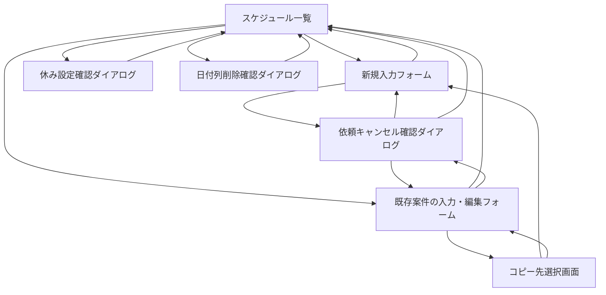

# 画面一覧

## 画面設計方針

現行Excelの利点である「日付と時間帯を見れば全体感が分かる」特徴を残しつつ、各案件の詳細情報を1件単位で確認できる画面構成にする。

MVPではログイン、ユーザー管理、権限管理は行わない。社員も配送・設置担当者も、掲示板のように同じ画面を同じ権限で参照・編集できる。

## MVP画面一覧

初期MVPではS-001からS-006を対象に、最小限の項目入力、自動保存、一覧反映、二重確認付きの依頼キャンセル・休み設定・日付列削除、案件コピーまで実際に動作させる。細かなUI調整は、その後の反復開発で追加する。

| ID | 画面名 | 主な利用者 | 目的 |
| --- | --- | --- | --- |
| S-001 | 月間スケジュール一覧画面 | 全利用者 | 現在月を起点に、日付・30分単位の予定をExcelに近い表で確認する |
| S-002 | 案件入力・編集フォーム | 全利用者 | 案件の詳細情報を入力・編集する |
| S-003 | 依頼キャンセル確認ダイアログ | 全利用者 | 押し間違いを防ぎながら依頼をキャンセルする |
| S-004 | コピー先選択画面 | 全利用者 | 日付入力または簡易スケジュール表から案件のコピー先を選ぶ |
| S-005 | 休み設定確認ダイアログ | 全利用者 | 対象日の全案件削除を確認してから休み表示へ置き換える |
| S-006 | 日付列削除確認ダイアログ | 全利用者 | 対象日を確認してから日付列を一覧から削除する |

## 画面詳細

### S-001 月間スケジュール一覧画面

| 項目 | 内容 |
| --- | --- |
| 目的 | 現在月を起点に、日付・30分単位で案件の埋まり具合を確認する |
| 表示項目 | 対象年月、年月選択、月タブ、日付、時間帯、休み表示、先頭セルの依頼者名・作業種別・＊未入力表示、2セル目以降の矢印、案件単位の色 |
| 主な操作 | 月切り替え、日付の休み設定・解除、日付列の削除、空白セルクリックによる新規入力、入力済みセルクリックによる既存案件の確認・編集 |
| MVP | 最重要 |

補足:

- 現行Excelに近い表形式を採用する
- サイトを開いた時点の現在年月を自動表示する
- 対象月に含まれるすべての水曜日・金曜日を日付列として自動表示する
- 日付列は月内の日付が早い順に左から並べる
- 祝日と重なる水曜日・金曜日も既定では表示する
- 日付見出しの操作から、その日を休みに設定または通常日に戻せる
- 休みに設定するときは、対象日と削除される案件数を表示した確認ダイアログを出す
- 確認後、その日の案件をすべて削除し、列全体を休み表示へ置き換える
- 祝日などで不要な場合は、日付見出しの操作からその日付列を一覧から削除できる
- 日付列削除時は対象日を表示した確認ダイアログを出す
- MVPでは非表示にした日付列を画面から復元する操作は用意しない
- 休みの日は先頭の時間セルに `休み` と表示し、その日の全時間セルを未入力状態とは異なる専用色で表示する
- 休みの日の空白セルはクリック操作を受け付けず、新規入力フォームへ遷移しない
- 月タブは、サイト表示時点の現在月を基準に前月・当月・翌月の3か月分を表示する
- 前月以前の過去月は閲覧専用とし、空白セルをクリックしても新規入力フォームへ遷移しない
- 過去月では休み設定・解除と日付列削除を操作できない
- 前月・当月・翌月以外の月を参照する年月選択は、初期MVP完成後に追加する
- たとえば6月28日に開いた場合は6月版を表示し、7月予定を入れたい場合は月タブから7月版へ移動する
- 1セルは30分単位とする
- 表示時間帯は8:30-17:30固定とし、1日あたり18セルを表示する
- 1セルに入る案件は1件のみとする
- 同じ案件が複数セルにまたがる場合、同じ色で表示する
- 複数セルにまたがる案件では、先頭セルに依頼者名と作業種別を表示し、2セル目以降には矢印を表示する
- 依頼者名、開始時間、終了時間がそろっているが、他の必須項目が不足している場合は、先頭セルの依頼者名の下あたりに `＊未入力` と表示する
- 作業種別はセル内に表示するが、依頼内容、会社名、機械名、住所などは表示せず、案件入力・編集フォームで確認する
- 作業種別によってフォーム項目は切り替えず、細かい違いは依頼内容にまとめて入力する
- 色はシステム側で自動割り当てする。基本案は5色程度の固定パレットだが、よりシンプルな実装方法がある場合は採用してよい
- 前後の案件で同じ色が連続せず、キャンセル後も案件の時間範囲を見分けやすいことを優先する
- 利用者が色を選ぶ機能はMVPでは用意しない
- 空白セルをクリックした場合は、その日付の新規入力フォームへ遷移する
- 空白セルから開いた新規入力フォームでは、クリックした時間帯で入力時間を固定しない
- 入力済みセルをクリックした場合は、そのセルに対応する既存案件の入力・編集フォームへ遷移する
- 同じ案件が複数セルにまたがる場合、どのセルをクリックしても同じ案件の入力・編集フォームへ遷移する
- その日の全セルが埋まっている場合、新規入力フォームへ移動できる空白セルは存在しない
- 依頼者名、開始時間、終了時間がそろっている場合のみ一覧へ反映する
- 同じ日の既存案件と時間範囲が重なる場合は反映しない

### S-002 案件入力・編集フォーム

| 項目 | 内容 |
| --- | --- |
| 目的 | Excelセルに収まらない案件詳細を入力・確認する |
| 共通必須項目 | 依頼者名、開始時間、終了時間、作業種別 |
| 通常作業の必須項目 | 設置、回収、交換、配達の場合のみ、依頼内容、現場住所、現場到着希望時間 |
| 条件付き必須 | 設置、回収、交換、配達で同行ありチェックを付けた場合のみ、集合場所、出発時間、使用車両 |
| 任意項目 | 出庫要否、備考 |
| 主な操作 | この入力内容をほかの日時にコピーする、入力、編集、前のページに戻る、依頼キャンセル |
| MVP | 最重要 |

補足:

- 日付はスケジュール一覧で選択した日付を使う
- 過去月の案件フォームは閲覧専用とし、入力、編集、キャンセル、コピーを操作できない
- フォーム上部に `この入力内容をほかの日時にコピーする` 操作を配置する
- コピー先では日付と案件IDを新しくし、それ以外の入力値をコピー済みの状態でフォームを開く
- コピー元の案件は削除せず、そのまま残す
- コピーした開始時間・終了時間が移動先の既存案件と重なる場合は保存せず、フォーム上に重複エラーを表示する
- 対象日が休みの場合は全入力項目を無効化し、保存できないようにする
- 開始時間・終了時間は8:30-17:30内のみ入力できる
- 作業種別は、設置、回収、交換、配達、入庫、商品管理から選択する
- 入庫、商品管理は通常の入力フォームから手動登録し、依頼者名も入力する
- 入庫、商品管理では共通必須4項目以外を任意入力とし、空欄でも `＊未入力` や不足警告を表示しない
- 現場到着希望時間は自由入力とし、`10:00`、`午前中`、`13時頃`、`時間指定なし` などを入力できる
- 同行ありチェックを付けた場合のみ、集合場所、出発時間、使用車両の3つの入力欄を動的に表示する
- 同行ありチェックが付いていない場合、3つの入力欄はフォーム上に表示しない
- 確定ボタンは置かない
- 明示的な確定ステータスは持たない
- 入力内容は入力欄から離れたタイミングで自動保存する
- 前のページに戻る操作をした場合も未保存内容を保存する
- 未入力の必須項目がある場合は、フォーム上部に赤文字で `依頼内容が未入力です。` のように項目名付きで表示する
- 備考欄の上には `例: 現地担当者への連絡、注意事項等あれば` のような補助テキストを表示する
- 時間重複時は保存せず、注意表示を出す

## 端末対応

- PCでの入力を主対象とする
- iPhoneではスケジュール一覧と案件詳細を正常に確認できることをMVPの前提とする
- iPhoneでも基本操作は可能にするが、入力作業の快適さはPCを優先する
- 月間スケジュール表は横幅が広くなるため、iPhoneではスクロール、拡大を前提にする
- iPhone専用の簡易表示はMVPでは作らない

### S-003 依頼キャンセル確認ダイアログ

| 項目 | 内容 |
| --- | --- |
| 目的 | 誤操作による依頼キャンセルを防ぐ |
| 表示項目 | キャンセル対象の日付、時間範囲、依頼者名、作業種別 |
| 主な操作 | キャンセル実行、戻る |
| MVP | 対象 |

補足:

- キャンセル済みステータスは持たない
- キャンセル後は案件データを物理削除し、該当セルを未入力扱いに戻す
- キャンセル履歴を残すかどうかは将来拡張で検討する

### S-004 コピー先選択画面

| 項目 | 内容 |
| --- | --- |
| 目的 | 既存案件の入力内容をコピーする勤務日を選ぶ |
| 表示項目 | 日付入力、対象年月、月切り替え、簡易スケジュール表、水曜日・金曜日、既存案件の時間帯、休み表示 |
| 主な操作 | 日付の直接入力、簡易スケジュール表の日付クリック、コピー中止 |
| MVP | 対象 |

補足:

- 日付入力と簡易スケジュール表のどちらからでもコピー先を選べる
- 簡易スケジュール表では水曜日・金曜日と既存案件の時間帯を確認できる
- 休みの日と非表示の日はコピー先として選択できない
- 過去月の日付はコピー先として選択できない
- 未来月の選択に上限は設けない
- コピー先を選ぶと、コピー値が入った新規案件フォームへ遷移する

### S-005 休み設定確認ダイアログ

| 項目 | 内容 |
| --- | --- |
| 目的 | 休み設定に伴う案件の一括削除を誤操作なく実行する |
| 表示項目 | 対象日、削除対象の案件数、全案件が物理削除される旨の警告 |
| 主な操作 | 休み設定を実行、戻る |
| MVP | 対象 |

補足:

- 依頼キャンセルと同じ確認方針を採用する
- 実行すると対象日の全案件を物理削除し、全時間セルを休み表示へ置き換える
- 戻る操作では案件も日付状態も変更しない

### S-006 日付列削除確認ダイアログ

| 項目 | 内容 |
| --- | --- |
| 目的 | 誤操作を防ぎながら不要な日付列を一覧から削除する |
| 表示項目 | 削除対象の日付、列が一覧から非表示になる旨の警告 |
| 主な操作 | 日付列削除を実行、戻る |
| MVP | 対象 |

補足:

- 二重確認後に対象日を `HIDDEN` として一覧から除外する
- 戻る操作では日付状態を変更しない
- MVPでは画面からの復元操作を用意しない

## 将来拡張画面

| ID | 画面名 | 内容 |
| --- | --- | --- |
| F-001 | ログイン画面 | 利用者を識別し、操作履歴や権限管理を行う |
| F-002 | ユーザー管理画面 | 利用者と権限を管理する |
| F-003 | 変更履歴画面 | 案件ごとの変更履歴を確認する |
| F-004 | 通知設定画面 | 案件変更時の通知先や通知方法を設定する |
| F-005 | 地図・ルート画面 | 作業場所と移動順を地図で確認する |
| F-006 | Excel取込画面 | 既存Excelから案件候補を取り込む |
| F-007 | CSV出力画面 | 案件一覧を外部出力する |
| F-008 | 作業完了報告画面 | 完了メモや写真を登録する |
| F-009 | ダッシュボード画面 | 日別件数、未入力セル、時間帯の埋まり具合を可視化する |

## 画面遷移初期案

