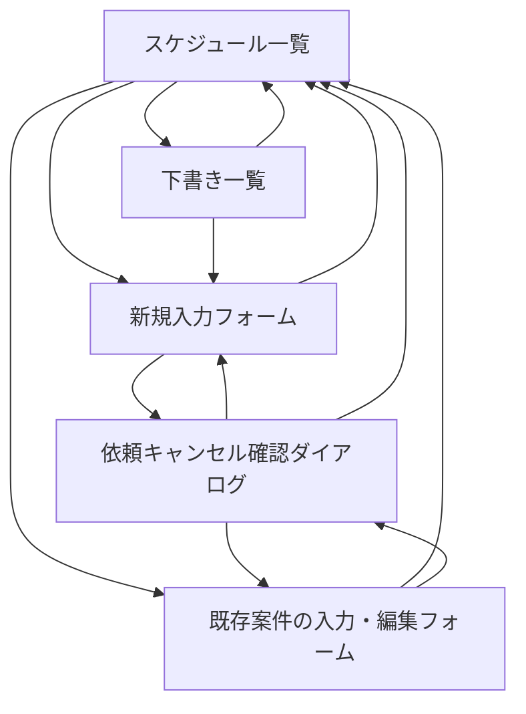

# 画面一覧

## 画面設計方針

現行Excelの利点である「日付と時間帯を見れば全体感が分かる」特徴を残しつつ、各案件の詳細情報を1件単位で確認できる画面構成にする。

MVPではログイン、ユーザー管理、権限管理は行わない。社員も配送・設置担当者も、掲示板のように同じ画面を同じ権限で参照・編集できる。

## MVP画面一覧

初期MVPではS-001からS-004を対象に、最小限の項目入力、自動保存、下書き管理、一覧反映、重複防止、二重確認付きの依頼キャンセルまで実際に動作させる。細かなUI調整は、その後の反復開発で追加する。

| ID | 画面名 | 主な利用者 | 目的 |
| --- | --- | --- | --- |
| S-001 | 月間スケジュール一覧画面 | 全利用者 | 現在月を起点に、日付・30分単位の予定をExcelに近い表で確認する |
| S-002 | 案件入力・編集フォーム | 全利用者 | 案件の詳細情報を入力・編集する |
| S-003 | 下書き一覧 | 全利用者 | 未完成の入力を確認し、入力再開または削除する |
| S-004 | 依頼キャンセル確認ダイアログ | 全利用者 | 押し間違いを防ぎながら依頼をキャンセルする |

## 画面詳細

### S-001 月間スケジュール一覧画面

| 項目 | 内容 |
| --- | --- |
| 目的 | 現在月を起点に、日付・30分単位で案件の埋まり具合を確認する |
| 表示項目 | 対象年月、月タブ、下書き件数、日付、時間帯、先頭セルの依頼者名・作業種別・＊未入力表示、2セル目以降の矢印、案件単位の色 |
| 主な操作 | 月切り替え、下書き一覧表示、空白セルクリックによる新規入力、入力済みセルクリックによる既存案件の確認・編集 |
| MVP | 最重要 |

補足:

- 現行Excelに近い表形式を採用する
- サイトを開いた時点の日本時間から現在年月を取得し、その月を自動表示する
- 対象月に含まれるすべての水曜日・金曜日を日付列として自動表示する
- 日付列は月内の日付が早い順に左から並べる
- 月タブは、サイト表示時点の現在月を基準に前月・当月・翌月の3か月分を表示する
- 前月以前の過去月は閲覧専用とし、空白セルをクリックしても新規入力フォームへ遷移しない
- 前月・当月・翌月以外の月を参照する年月選択、祝日除外、休み設定は初期MVP完成後に追加する
- たとえば6月28日に開いた場合は6月版を表示し、7月予定を入れたい場合は月タブから7月版へ移動する
- 1セルは30分単位とする
- 表示時間帯は8:30-17:30固定とし、1日あたり18セルを表示する
- 1セルに入る案件は1件のみとする
- 同じ案件が複数セルにまたがる場合、同じ色で表示する
- 複数セルにまたがる案件では、先頭セルに依頼者名と作業種別を表示し、2セル目以降には矢印を表示する
- 依頼者名、開始時間、終了時間がそろっているが、他の必須項目が不足している場合は、先頭セルの依頼者名の下あたりに `＊未入力` と表示する
- 作業種別はセル内に表示するが、依頼内容、会社名、機械名、住所などは表示せず、案件入力・編集フォームで確認する
- 作業種別によってフォーム項目は切り替えず、細かい違いは依頼内容にまとめて入力する
- 色はシステム側で自動割り当てする。基本案は5色程度の固定パレットだが、よりシンプルな実装方法がある場合は採用してよい
- 前後の案件で同じ色が連続せず、キャンセル後も案件の時間範囲を見分けやすいことを優先する
- 利用者が色を選ぶ機能はMVPでは用意しない
- 空白セルをクリックした場合は、その日付の新規入力フォームへ遷移する
- 空白セルから開いた新規入力フォームでは、クリックした時間帯で入力時間を固定しない
- 入力済みセルをクリックした場合は、そのセルに対応する既存案件の入力・編集フォームへ遷移する
- 同じ案件が複数セルにまたがる場合、どのセルをクリックしても同じ案件の入力・編集フォームへ遷移する
- その日の全セルが埋まっている場合、新規入力フォームへ移動できる空白セルは存在しない
- 依頼者名、開始時間、終了時間がそろっている場合のみ一覧へ反映する
- 同じ日の既存案件と時間範囲が重なる場合は反映しない
- 同時登録では先に保存された案件を反映し、後続利用者へ競合した時間帯を表示する

### S-002 案件入力・編集フォーム

| 項目 | 内容 |
| --- | --- |
| 目的 | Excelセルに収まらない案件詳細を入力・確認する |
| 共通必須項目 | 依頼者名、開始時間、終了時間、作業種別 |
| 通常作業の必須項目 | 設置、回収、交換、配達の場合のみ、依頼内容、現場住所、現場到着希望時間 |
| 条件付き必須 | 設置、回収、交換、配達で同行ありチェックを付けた場合のみ、集合場所、出発時間、使用車両 |
| 任意項目 | 出庫状態、備考 |
| 主な操作 | 入力、編集、前のページに戻る、依頼キャンセル |
| MVP | 最重要 |

補足:

- 日付はスケジュール一覧で選択した日付を使う
- 過去月の案件フォームは閲覧専用とし、入力、編集、キャンセル、コピーを操作できない
- 開始時間・終了時間は8:30-17:30内のみ入力できる
- 作業種別は、設置、回収、交換、配達、入庫、商品管理から選択する
- 入庫、商品管理は通常の入力フォームから手動登録し、依頼者名も入力する
- 入庫、商品管理では共通必須4項目以外を任意入力とし、空欄でも `＊未入力` や不足警告を表示しない
- 現場到着希望時間は自由入力とし、`10:00`、`午前中`、`13時頃`、`時間指定なし` などを入力できる
- 同行ありチェックを付けた場合のみ、集合場所、出発時間、使用車両の3つの入力欄を動的に表示する
- 同行ありチェックが付いていない場合、3つの入力欄はフォーム上に表示しない
- 同行ありチェックを外した場合、集合場所、出発時間、使用車両の保存値を削除する
- 出庫状態は `未回答`、`出庫が必要`、`出庫済み` の3状態とし、初期値は `未回答` とする
- 確定ボタンは置かない
- 明示的な確定ステータスは持たない
- 入力内容は入力欄から離れたタイミングで自動保存する
- 前のページに戻る操作をした場合も未保存内容を保存する
- 最初の入力値を保存した時点で下書きとし、未入力のまま離れた場合は空レコードを作らない
- 依頼者名、開始時間、終了時間がそろった時点で重複を再確認し、空いていれば通常案件として一覧へ反映する
- 重複時は入力値を下書きに残し、競合した時間帯を含むエラーを表示する
- 未入力の必須項目がある場合は、フォーム上部に赤文字で `依頼内容が未入力です。` のように項目名付きで表示する
- 備考欄の上には `例: 現地担当者への連絡、注意事項等あれば` のような補助テキストを表示する
- 時間重複時は保存せず、注意表示を出す

## 端末対応

- PCでの入力を主対象とする
- iPhoneではスケジュール一覧と案件詳細を正常に確認できることをMVPの前提とする
- iPhoneでも基本操作は可能にするが、入力作業の快適さはPCを優先する
- 月間スケジュール表は横幅が広くなるため、iPhoneではスクロール、拡大を前提にする
- iPhone専用の簡易表示はMVPでは作らない

### S-003 下書き一覧

| 項目 | 内容 |
| --- | --- |
| 目的 | 一覧へ未反映の入力を見失わず、再開または削除できるようにする |
| 表示項目 | 下書き件数、作業日、入力済みの依頼者名、最終更新日時 |
| 主な操作 | 入力を再開、下書きを削除、一覧へ戻る |
| MVP | 対象 |

補足:

- 月間一覧上部の `下書き一覧（件数）` から開く
- 表示月にかかわらず、全月の下書きを最終更新日時の新しい順に表示する
- 依頼者名が未入力の場合は、作業日と `依頼者名未入力` を表示する
- 下書きは時間枠を確保しない
- 下書き削除は確認後に物理削除する
- 過去月の下書きは入力を再開できないが、削除はできる
- 依頼者名、開始時間、終了時間がそろって通常案件になった時点で下書き一覧から除外する

### S-004 依頼キャンセル確認ダイアログ

| 項目 | 内容 |
| --- | --- |
| 目的 | 誤操作による依頼キャンセルを防ぐ |
| 表示項目 | キャンセル対象の日付、時間範囲、依頼者名、作業種別 |
| 主な操作 | キャンセル実行、戻る |
| MVP | 対象 |

補足:

- キャンセル済みステータスは持たない
- キャンセル後は案件データを物理削除し、該当セルを未入力扱いに戻す
- キャンセル履歴を残すかどうかは将来拡張で検討する

## 将来拡張画面

| ID | 画面名 | 内容 |
| --- | --- | --- |
| F-001 | ログイン画面 | 利用者を識別し、操作履歴や権限管理を行う |
| F-002 | ユーザー管理画面 | 利用者と権限を管理する |
| F-003 | 変更履歴画面 | 案件ごとの変更履歴を確認する |
| F-004 | 通知設定画面 | 試運転で見落としが発生し、通知が必要と判断した場合に通知先や通知方法を設定する |
| F-005 | 地図・ルート画面 | 作業場所と移動順を地図で確認する |
| F-006 | CSV出力画面 | 案件一覧を外部出力する |
| F-007 | 作業完了報告画面 | 完了メモや写真を登録する |
| F-008 | ダッシュボード画面 | 日別件数、未入力セル、時間帯の埋まり具合を可視化する |
| F-009 | コピー先選択画面 | 日付入力または簡易スケジュール表から案件のコピー先を選ぶ |
| F-010 | 休み設定確認ダイアログ | 対象日の案件を確認して休み表示へ置き換える |

任意年月選択、祝日列の自動除外、案件コピー、休み設定は、初期MVP後に月間一覧と案件フォームへ追加する。

## 画面遷移初期案

