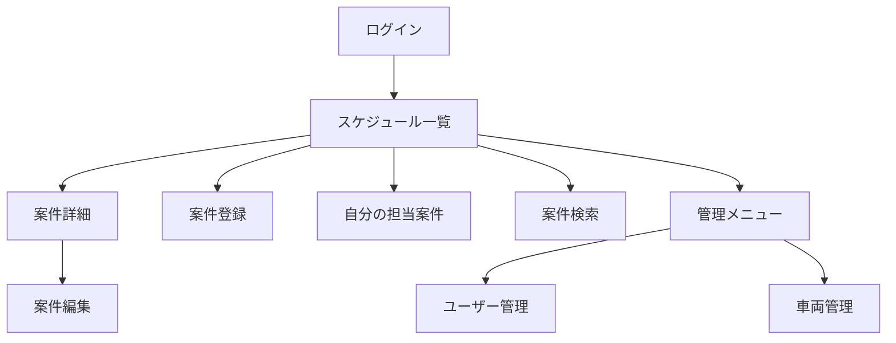

# 画面一覧

## 画面設計方針

現行Excelの利点である「日付と時間帯を見れば全体感が分かる」特徴を残しつつ、各案件の詳細情報を1件単位で確認できる画面構成にする。

MVPでは画面数を増やしすぎず、スケジュール確認、案件登録、案件詳細に集中する。

## MVP画面一覧

| ID | 画面名 | 主な利用者 | 目的 |
| --- | --- | --- | --- |
| S-001 | ログイン画面 | 全ユーザー | ユーザーを識別し、操作権限と更新者を記録する |
| S-002 | スケジュール一覧画面 | 全ユーザー | 日付・時間帯ごとの案件を確認する |
| S-003 | 自分の担当案件画面 | 配送・設置担当者 | 自分に割り当てられた案件だけを確認する |
| S-004 | 案件詳細画面 | 全ユーザー | 案件の詳細情報を確認する |
| S-005 | 案件登録画面 | 社員、管理者 | 新しい案件を登録する |
| S-006 | 案件編集画面 | 社員、管理者 | 登録済み案件を編集する |
| S-007 | 案件検索画面 | 社員、管理者 | 日付、担当者、ステータスで案件を検索する |
| S-008 | ユーザー管理画面 | 管理者 | ユーザーと権限を管理する |
| S-009 | 車両管理画面 | 管理者 | 車両の表示名と利用可否を管理する |

## 画面詳細

### S-001 ログイン画面

| 項目 | 内容 |
| --- | --- |
| 目的 | ユーザーごとの操作記録と権限管理を行う |
| 入力項目 | メールアドレス、パスワード |
| 主な操作 | ログイン |
| MVP | 対象 |

### S-002 スケジュール一覧画面

| 項目 | 内容 |
| --- | --- |
| 目的 | 日付・時間帯ごとの案件を一覧する |
| 表示項目 | 日付、時間帯、案件名、作業区分、主担当、ステータス |
| 主な操作 | 日付移動、担当者絞り込み、案件詳細への遷移、新規登録 |
| MVP | 最重要 |

補足:

- 週表示を基本とし、必要に応じて日表示を追加する
- Excelのような時間帯グリッドを参考にする
- セルには概要だけを表示し、詳細は案件詳細画面に集約する

### S-003 自分の担当案件画面

| 項目 | 内容 |
| --- | --- |
| 目的 | 担当者が自分の案件だけを素早く確認する |
| 表示項目 | 作業日、開始時間、終了時間、案件名、集合場所、ステータス |
| 主な操作 | 詳細確認、ステータス更新 |
| MVP | 対象 |

### S-004 案件詳細画面

| 項目 | 内容 |
| --- | --- |
| 目的 | Excelセルに収まらない案件詳細を確認する |
| 表示項目 | 基本情報、日時、場所、担当者、同行者、車両、持参物、注意事項、更新情報 |
| 主な操作 | 編集、ステータス更新、一覧へ戻る |
| MVP | 最重要 |

### S-005 案件登録画面

| 項目 | 内容 |
| --- | --- |
| 目的 | 社員が案件を登録する |
| 入力項目 | 案件名、作業区分、作業日、開始時間、終了時間、場所情報、担当者、車両、持参物、注意事項 |
| 主な操作 | 登録、下書き保存は将来拡張 |
| MVP | 対象 |

### S-006 案件編集画面

| 項目 | 内容 |
| --- | --- |
| 目的 | 予定変更や情報追加を行う |
| 入力項目 | 案件登録画面と同等 |
| 主な操作 | 更新、キャンセル、ステータス変更 |
| MVP | 対象 |

### S-007 案件検索画面

| 項目 | 内容 |
| --- | --- |
| 目的 | 過去案件や特定担当者の案件を検索する |
| 検索条件 | 日付範囲、担当者、ステータス、作業区分 |
| 主な操作 | 検索、詳細表示 |
| MVP | 簡易版を対象 |

### S-008 ユーザー管理画面

| 項目 | 内容 |
| --- | --- |
| 目的 | ユーザーと権限を管理する |
| 入力項目 | 表示名、メールアドレス、ロール、有効状態 |
| 主な操作 | 登録、編集、無効化 |
| MVP | 簡易版を対象 |

### S-009 車両管理画面

| 項目 | 内容 |
| --- | --- |
| 目的 | 案件に割り当てる車両を管理する |
| 入力項目 | 車両表示名、利用可否、備考 |
| 主な操作 | 登録、編集、無効化 |
| MVP | 簡易版を対象 |

## 将来拡張画面

| ID | 画面名 | 内容 |
| --- | --- | --- |
| F-001 | 通知設定画面 | 案件変更時の通知先や通知方法を設定する |
| F-002 | 変更履歴画面 | 案件ごとの変更履歴を確認する |
| F-003 | 地図・ルート画面 | 作業場所と移動順を地図で確認する |
| F-004 | Excel取込画面 | 既存Excelから案件候補を取り込む |
| F-005 | CSV出力画面 | 案件一覧を外部出力する |
| F-006 | 作業完了報告画面 | 完了メモや写真を登録する |
| F-007 | ダッシュボード画面 | 日別件数、担当者別件数、未確認案件を可視化する |

## 画面遷移初期案

